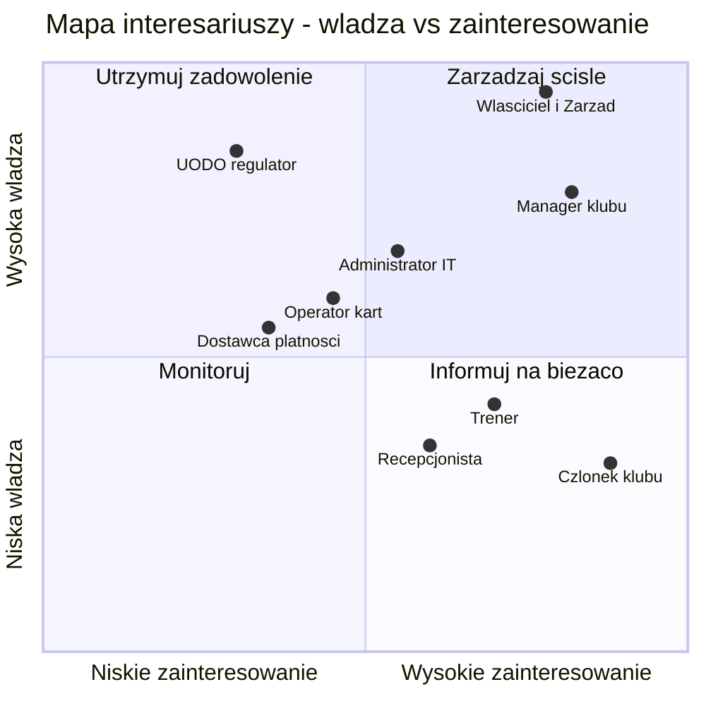
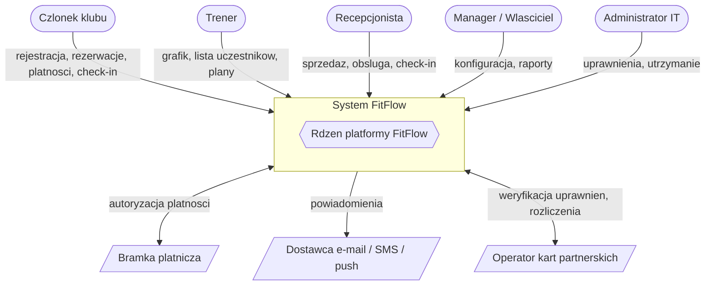
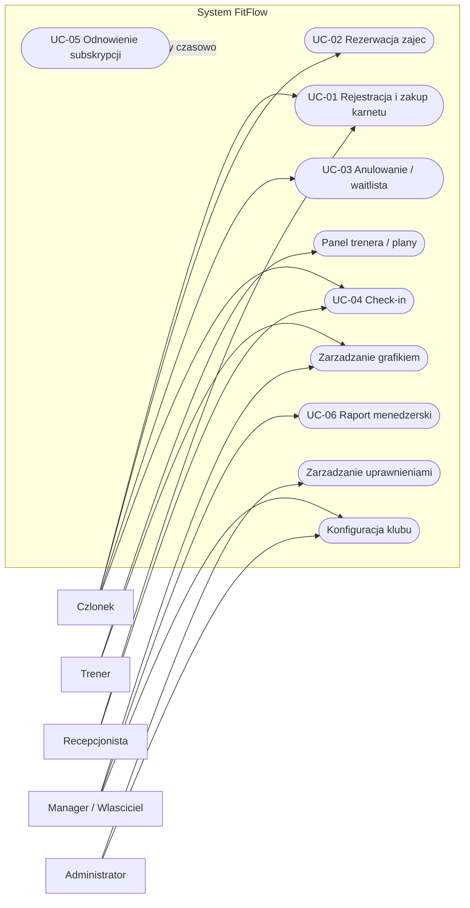
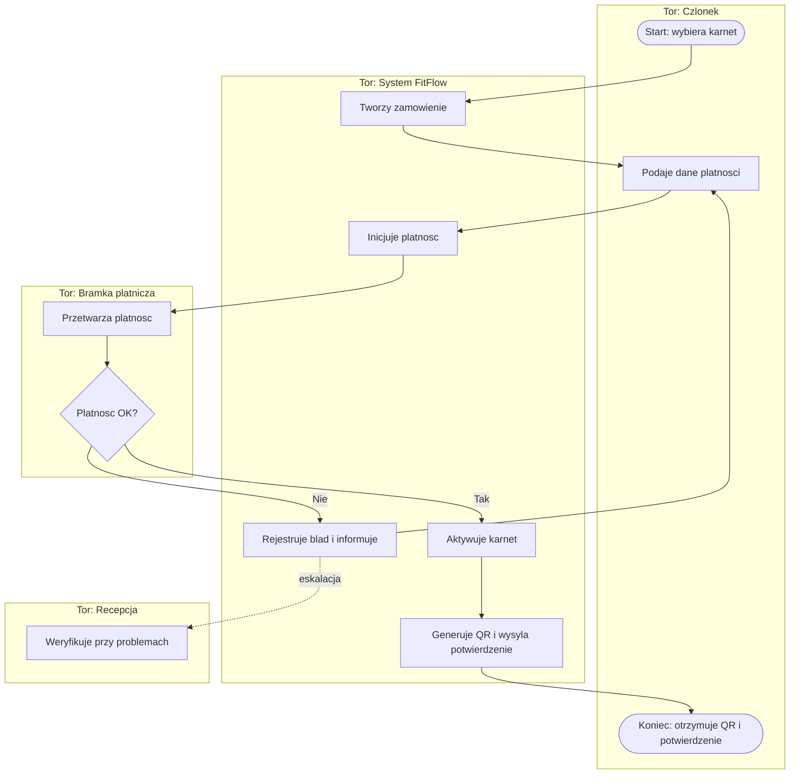
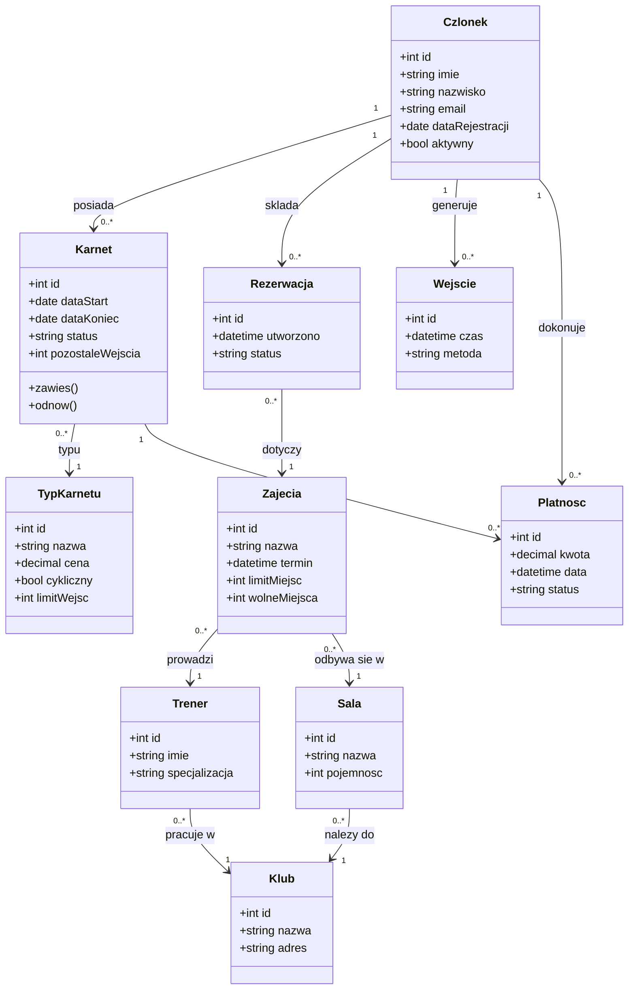
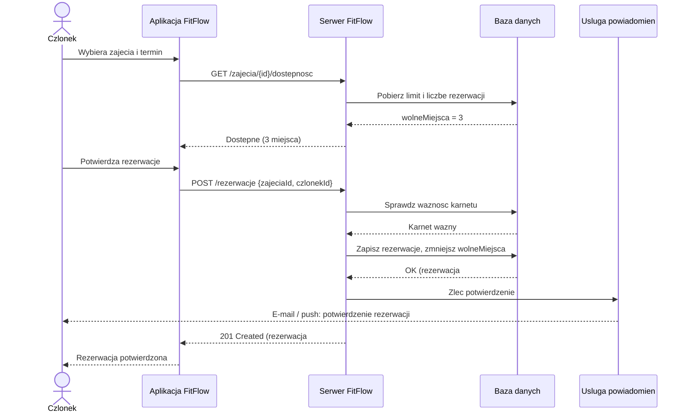
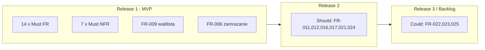
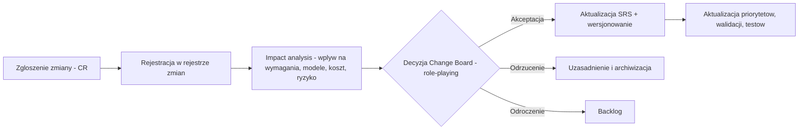

# Dokumentacja inżynierii wymagań — System klubu fitness „FitFlow"

| Pole | Wartość                                                      |
|---|--------------------------------------------------------------|
| **Przedmiot** | Inżynieria wymagań                                           |
| **Typ projektu** | Nowy system informatyczny (greenfield)                       |
| **Temat** | System zarządzania siecią klubów fitness — *FitFlow*         |
| **Klient (fikcyjny)** | Vitality Fitness sp. z o.o. (3 kluby, plany ekspansji)       |
| **Standard dokumentacji** | SRS (IEEE 830 / ISO/IEC/IEEE 29148) + podejście Volere       |
| **Zespół** | Bartłomiej Podlewski, Dawid Osak, Jakub Wiatr, Norbert Szopa |

---

## Mapa punktacji i warunki zaliczenia

| # | Obszar oceny | Maks | Gdzie w dokumencie | Pkt |
|---|---|:--:|---|:--:|
| 1 | Kontekst i interesariusze | 5 | [Część I](#część-i--specyfikacja-wymagań-oprogramowania-srs) §2.3, §3 | 5 |
| 2 | Pozyskiwanie wymagań | 7 | [Część II](#część-ii--pozyskiwanie-wymagań) | 7 |
| 3 | Specyfikacja wymagań | 8 | [Część I](#część-i--specyfikacja-wymagań-oprogramowania-srs) §4–§6 | 8 |
| 4 | Modelowanie | 5 | [Część I](#część-i--specyfikacja-wymagań-oprogramowania-srs) §7 | 5 |
| 5 | Priorytetyzacja | 5 | [Część III](#część-iii--priorytetyzacja-wymagań) | 5 |
| 6 | Walidacja | 5 | [Część IV](#część-iv--walidacja-wymagań) | 5 |
| 7 | Zarządzanie zmianą | 7 | [Część V](#część-v--zarządzanie-zmianą) | 7 |
| 8 | Role-playing | 3 | [Część VI](#część-vi--role-playing) | 3 |
| 9 | Dokumentacja SRS + Volere | 5 | [Część I](#część-i--specyfikacja-wymagań-oprogramowania-srs) (SRS) + [Część VII](#część-vii--dokumentacja-volere) (Volere) | 5 |
| | **SUMA** | **50** | | **50** |

---

## Spis treści

1. **[Część I — Specyfikacja Wymagań Oprogramowania (SRS)](#część-i--specyfikacja-wymagań-oprogramowania-srs)** — wprowadzenie, opis ogólny, interesariusze *(obszar 1)*, wymagania funkcjonalne i niefunkcjonalne *(obszar 3)*, user stories i przypadki użycia, modele *(obszar 4)*
2. **[Część II — Pozyskiwanie wymagań](#część-ii--pozyskiwanie-wymagań)** — wywiady, ankieta, analiza konkurencji *(obszar 2)*
3. **[Część III — Priorytetyzacja wymagań](#część-iii--priorytetyzacja-wymagań)** — MoSCoW + Kano *(obszar 5)*
4. **[Część IV — Walidacja wymagań](#część-iv--walidacja-wymagań)** — checklist jakości, scenariusze testowe, macierz śledzenia *(obszar 6)*
5. **[Część V — Zarządzanie zmianą](#część-v--zarządzanie-zmianą)** — 3 zmiany + impact analysis *(obszar 7)*
6. **[Część VI — Role-playing](#część-vi--role-playing)** — opis ról i transkrypcje warsztatów *(obszar 8)*
7. **[Część VII — Dokumentacja Volere](#część-vii--dokumentacja-volere)** — karty wymagań i fit criteria *(obszar 9)*

---

## Część I — Specyfikacja Wymagań Oprogramowania (SRS)

### 1. Wprowadzenie

#### 1.1 Cel dokumentu
Niniejszy dokument stanowi pełną specyfikację wymagań dla systemu **FitFlow** — platformy
wspierającej zarządzanie siecią klubów fitness *Vitality Fitness*. Dokument definiuje
zakres, kontekst, wymagania funkcjonalne i niefunkcjonalne, modele oraz wymagania
interfejsów. Adresatami są: zespół projektowy, klient i interesariusze (do akceptacji
zakresu), zespół deweloperski (do implementacji) oraz zespół QA (do walidacji i testów).

#### 1.2 Zakres produktu
FitFlow to **webowo-mobilna platforma** obsługująca pełen cykl życia członka klubu:
od rejestracji i zakupu karnetu, przez rezerwację zajęć grupowych i treningów
personalnych, kontrolę wejść, płatności cykliczne, aż po raportowanie zarządcze.

**W zakresie (in scope):**
- zarządzanie kontami członków i pracowników,
- sprzedaż i obsługa karnetów/subskrypcji (w tym online i karty partnerskie),
- grafik i rezerwacje zajęć grupowych oraz treningów personalnych,
- kontrola wejść (QR/karta zbliżeniowa),
- płatności online, cykliczne i fakturowanie,
- powiadomienia (e-mail/SMS/push),
- raporty i analityka dla kadry zarządzającej,
- obsługa wielu lokalizacji sieci.

**Poza zakresem (out of scope):**
- pełna księgowość i kadry/płace (integracja z systemem zewnętrznym),
- sklep z odżywkami/sprzętem (e-commerce),
- urządzenia wearable i pełna telemetria treningowa (rozważane w przyszłości),
- fizyczne bramki obrotowe (system dostarcza tylko API/sygnał autoryzacji).

#### 1.3 Definicje, akronimy i skróty (słownik)

| Termin | Definicja |
|---|---|
| **Członek** | Klient klubu posiadający konto i (zwykle) aktywny karnet. |
| **Karnet / Członkostwo** | Uprawnienie do korzystania z klubu w określonym czasie/zakresie. |
| **Karnet OPEN** | Karnet bez limitu wejść w okresie ważności. |
| **Zajęcia grupowe** | Zajęcia prowadzone przez trenera dla wielu uczestników (np. joga, spinning). |
| **Trening personalny (PT)** | Indywidualna sesja członka z trenerem. |
| **Check-in** | Rejestracja wejścia członka do klubu z weryfikacją uprawnień. |
| **Waitlista** | Lista rezerwowa na zajęcia o wyczerpanym limicie miejsc. |
| **Karta partnerska** | Karta sportowa operatora zewnętrznego (np. Multisport, Medicover Sport). |
| **RBAC** | Role-Based Access Control — kontrola dostępu oparta na rolach. |
| **Fit criterion** | Mierzalne kryterium akceptacji wymagania (podejście Volere). |
| **SRS** | Software Requirements Specification. |
| **MoSCoW** | Metoda priorytetyzacji: Must / Should / Could / Won't have. |
| **RODO** | Rozporządzenie o Ochronie Danych Osobowych (GDPR). |
| **PCI-DSS** | Standard bezpieczeństwa danych kart płatniczych. |
| **SLA** | Service Level Agreement — umowa o poziomie usług. |
| **RPO / RTO** | Recovery Point / Time Objective — cele odtworzeniowe po awarii. |

#### 1.4 Odniesienia
- IEEE Std 830-1998 — *Recommended Practice for Software Requirements Specifications*.
- ISO/IEC/IEEE 29148:2018 — *Requirements engineering*.
- ISO/IEC 25010:2011 — *Model jakości produktu programowego*.
- Suzanne & James Robertson — *Volere Requirements Specification Template*.
- Rozporządzenie (UE) 2016/679 (RODO).
- Dokumenty projektu: [`02_Pozyskiwanie_wymagan.md`](#część-ii--pozyskiwanie-wymagań),
  [`03_Priorytetyzacja.md`](#część-iii--priorytetyzacja-wymagań), [`04_Walidacja.md`](#część-iv--walidacja-wymagań),
  [`05_Zarzadzanie_zmiana.md`](#część-v--zarządzanie-zmianą), [`06_Role_playing.md`](#część-vi--role-playing),
  [`07_Volere.md`](#część-vii--dokumentacja-volere).

#### 1.5 Przegląd dokumentu
Rozdział 2 opisuje produkt z lotu ptaka (kontekst, funkcje, użytkownicy, ograniczenia).
Rozdział 3 przedstawia interesariuszy i mapę interesariuszy. Rozdziały 4–5 zawierają
wymagania funkcjonalne i niefunkcjonalne (z mierzalnymi kryteriami). Rozdział 6 to user
stories i przypadki użycia. Rozdział 7 zawiera modele (diagramy). Rozdział 8 — wymagania
interfejsów. Rozdział 9 — historię zmian.

---

### 2. Opis ogólny

#### 2.1 Perspektywa produktu
FitFlow jest **nowym, samodzielnym systemem** (greenfield), zastępującym dotychczasowy
rozproszony zestaw narzędzi (arkusz kalkulacyjny z grafikiem, papierowe karnety, ręczne
rozliczenia). Współpracuje z usługami zewnętrznymi: bramką płatniczą, dostawcą
e-mail/SMS oraz (po wdrożeniu CR-02) operatorami kart partnerskich.

**Diagram kontekstowy** — zob. [§7.1](#71-diagram-kontekstowy).

#### 2.2 Podsumowanie funkcji produktu
Główne grupy funkcji (moduły):

| Moduł | Opis |
|---|---|
| **M1. Konta i członkostwo** | Rejestracja, logowanie, profil, zgody RODO. |
| **M2. Karnety i subskrypcje** | Zakup, odnawianie, zawieszanie, karty partnerskie. |
| **M3. Zajęcia grupowe** | Grafik, rezerwacje, waitlista, zarządzanie terminami. |
| **M4. Treningi personalne** | Rezerwacja PT, panel i kalendarz trenera. |
| **M5. Kontrola wejść** | Check-in QR/karta z weryfikacją uprawnień. |
| **M6. Płatności** | Płatności online, cykliczne, faktury, historia. |
| **M7. Powiadomienia** | E-mail/SMS/push: przypomnienia, potwierdzenia, alerty. |
| **M8. Raporty i analityka** | Pulpity menedżerskie: frekwencja, przychód, retencja. |
| **M9. Administracja** | Role i uprawnienia (RBAC), konfiguracja sieci/klubów. |
| **M10. Zasoby** | Zarządzanie salami i sprzętem, pojemność sal. |

#### 2.3 Klasy i charakterystyki użytkowników *(obszar 1 — identyfikacja użytkowników)*

| Klasa użytkownika | Liczność | Kompetencje IT | Częstość użycia | Kluczowe potrzeby |
|---|---|---|---|---|
| **Członek klubu** | ~6 000 / sieć | zróżnicowane (15–70 lat) | codziennie/tygodniowo | szybka rezerwacja, grafik, płatności, mobilność |
| **Trener** | ~40 | średnie | codziennie | kalendarz, lista uczestników, plany treningowe |
| **Recepcjonista** | ~15 | średnie | ciągłe (zmiana) | obsługa członka, sprzedaż, check-in, reklamacje |
| **Manager klubu** | 3 (po 1/klub) | średnio-wysokie | codziennie | grafik, raporty operacyjne, obłożenie |
| **Właściciel / Zarząd** | 2 | średnie | tygodniowo | KPI, przychód, retencja, decyzje strategiczne |
| **Administrator IT** | 1–2 | wysokie | wg potrzeb | uprawnienia, bezpieczeństwo, integracje, utrzymanie |

#### 2.4 Środowisko operacyjne
- **Klient:** przeglądarka (desktop/mobile) + aplikacja mobilna (iOS/Android).
- **Serwer:** architektura chmurowa, konteneryzacja, baza relacyjna.
- **Integracje:** bramka płatnicza (REST API), dostawca e-mail/SMS, API kart partnerskich.
- **Sieć:** kluby połączone z chmurą; check-in działa również w trybie ograniczonym przy
  chwilowym braku łącza (bufor lokalny — zob. NFR-008/UC-04).

#### 2.5 Ograniczenia projektowe i implementacyjne
- **O1:** Zgodność z RODO (dane osobowe i zdrowotne — informacje o aktywności) i PCI-DSS.
- **O2:** Brak przechowywania pełnych danych kart płatniczych — wyłącznie tokenizacja.
- **O3:** Budżet i czas: MVP w 4 miesiące, zespół 4-osobowy.
- **O4:** Integracja płatności wyłącznie z certyfikowaną bramką (np. Przelewy24/Stripe).
- **O5:** Interfejs w języku polskim (i18n przewidziane jako rozszerzenie).
- **O6:** Hosting na terenie EOG (wymóg RODO dot. lokalizacji danych).

#### 2.6 Założenia i zależności
- **Z1:** Każdy klub ma stabilne łącze internetowe (z buforem awaryjnym dla check-in).
- **Z2:** Operatorzy kart partnerskich udostępniają API weryfikacji uprawnień.
- **Z3:** Członkowie posiadają adres e-mail i smartfon (dla QR i powiadomień push).
- **Z4:** Bramka płatnicza zapewnia obsługę płatności cyklicznych (recurring).
- **Z5:** Dane migracyjne (obecni członkowie) są dostępne w formacie CSV.

---

### 3. Interesariusze i kontekst
*Realizuje obszar 1 punktacji.*

#### 3.1 Lista interesariuszy

| # | Interesariusz | Typ | Rola w projekcie |
|---|---|---|---|
| S1 | **Właściciel / Zarząd Vitality Fitness** | wewnętrzny, sponsor | finansuje projekt, decyduje o zakresie i budżecie |
| S2 | **Manager klubu** | wewnętrzny, biznes | odbiorca raportów, zarządza grafikiem i personelem |
| S3 | **Członek klubu** | zewnętrzny, użytkownik końcowy | główny użytkownik, źródło przychodu |
| S4 | **Trener** | wewnętrzny, użytkownik | prowadzi zajęcia/PT, korzysta z panelu |
| S5 | **Recepcjonista** | wewnętrzny, użytkownik | obsługuje członków i sprzedaż na miejscu |
| S6 | **Administrator IT** | wewnętrzny, utrzymanie | bezpieczeństwo, uprawnienia, integracje |
| S7 | **Operator kart partnerskich** | zewnętrzny | dostarcza weryfikację i rozliczenia (CR-02) |
| S8 | **Dostawca bramki płatniczej** | zewnętrzny | przetwarza płatności |
| S9 | **UODO / regulator** | zewnętrzny, nadzorczy | egzekwuje zgodność z RODO |
| S10 | **Konkurencja** | zewnętrzny (kontekst) | punkt odniesienia (analiza konkurencji) |

#### 3.2 Mapa interesariuszy (władza / zainteresowanie)
Klasyfikacja wg modelu Mendelowa (Power/Interest Grid) — sterowanie zaangażowaniem:

**Strategie zaangażowania:**
- *Zarządzaj ściśle* (Właściciel, Manager): regularne warsztaty, akceptacja zakresu, raporty postępu.
- *Utrzymuj zadowolenie* (UODO/regulator, Administrator IT): zgodność, bezpieczeństwo, konsultacje.
- *Informuj* (Członek, Trener, Recepcjonista): ankiety, testy użyteczności, komunikaty o zmianach.
- *Monitoruj* (Operator kart, Dostawca płatności): kontrola SLA i kontraktów integracyjnych.

#### 3.3 Opis kontekstu systemu *(obszar 1 — opis kontekstu)*
Vitality Fitness to rosnąca sieć 3 klubów (plan: 6 w ciągu 2 lat). Obecnie procesy są
**rozproszone i ręczne**: grafik w arkuszu Google, karnety papierowe, rezerwacje
telefoniczne, rozliczenia w zeszycie. Skutki: kolejki na recepcji, błędy w rozliczeniach,
„martwe dusze" (opłaceni, nieaktywni członkowie), brak danych do decyzji biznesowych,
trudność skalowania na kolejne kluby. FitFlow centralizuje te procesy w jednym systemie,
automatyzuje rezerwacje i płatności, oraz dostarcza dane analityczne dla zarządu.
Granicę systemu i przepływy z otoczeniem przedstawia diagram kontekstowy ([§7.1](#71-diagram-kontekstowy)).

---

### 4. Wymagania funkcjonalne

Format: **FR-xxx** | Priorytet MoSCoW (uzasadnienia → [`03_Priorytetyzacja.md`](#część-iii--priorytetyzacja-wymagań)).
Pełne kryteria akceptacji (fit criteria) → [`07_Volere.md`](#część-vii--dokumentacja-volere).

#### Moduł M1 — Konta i członkostwo

| ID | Wymaganie | Priorytet | Źródło |
|---|---|---|---|
| **FR-001** | System umożliwia **rejestrację konta członka** samodzielnie online oraz przez recepcję; wymaga akceptacji regulaminu i zgód RODO. | Must | Wywiad: Właściciel, Recepcja |
| **FR-002** | System **uwierzytelnia użytkownika** (e-mail + hasło), umożliwia reset hasła i blokuje konto po 5 nieudanych próbach. | Must | NFR bezpieczeństwa, Admin |
| **FR-003** | Członek może **przeglądać i edytować profil** (dane kontaktowe, zdjęcie, preferencje powiadomień, zgody marketingowe). | Should | Ankieta |

#### Moduł M2 — Karnety i subskrypcje

| ID | Wymaganie | Priorytet | Źródło |
|---|---|---|---|
| **FR-004** | System prezentuje **ofertę karnetów** (OPEN, limitowany, jednorazowy, PT) i umożliwia ich **zakup**. | Must | Wywiad: Właściciel |
| **FR-005** | System obsługuje **odnawianie karnetu**, w tym **automatyczne przedłużanie** (subskrypcja) — *dodane w CR-01*. | Must | CR-01 |
| **FR-006** | Członek może **zawiesić (zamrozić) karnet** na określony czas (np. urlop/choroba), z wpływem na datę ważności. | Should | Ankieta, Recepcja |
| **FR-024** | System obsługuje **karty partnerskie** (np. Multisport): weryfikację uprawnień i naliczanie wejść — *dodane w CR-02*. | Should | CR-02, Właściciel |

#### Moduł M3 — Zajęcia grupowe i rezerwacje

| ID | Wymaganie | Priorytet | Źródło |
|---|---|---|---|
| **FR-007** | System wyświetla **grafik zajęć grupowych** (kalendarz) z filtrowaniem po typie, trenerze, lokalizacji i czasie. | Must | Ankieta, Wywiad |
| **FR-008** | Członek może **zarezerwować miejsce** na zajęciach, jeśli ma ważny karnet i są wolne miejsca. | Must | Ankieta |
| **FR-009** | System obsługuje **anulowanie rezerwacji** oraz **listę rezerwową (waitlista)** z automatycznym awansem przy zwolnieniu miejsca. | Must | Ankieta, Trener |
| **FR-010** | Manager/Trener może **tworzyć i edytować terminy zajęć** (typ, trener, sala, limit miejsc, cykliczność). | Must | Wywiad: Manager |

#### Moduł M4 — Treningi personalne

| ID | Wymaganie | Priorytet | Źródło |
|---|---|---|---|
| **FR-011** | Członek może **zarezerwować trening personalny** u wybranego trenera w dostępnym terminie. | Should | Wywiad: Trener |
| **FR-012** | Trener ma **panel** z kalendarzem, listą podopiecznych i możliwością przypisania **planu treningowego**. | Should | Wywiad: Trener |

#### Moduł M5 — Kontrola wejść

| ID | Wymaganie | Priorytet | Źródło |
|---|---|---|---|
| **FR-013** | System realizuje **check-in** (kod QR w aplikacji lub karta zbliżeniowa) z **weryfikacją ważności karnetu** i rejestracją wejścia. | Must | Wywiad: Recepcja, Właściciel |

#### Moduł M6 — Płatności

| ID | Wymaganie | Priorytet | Źródło |
|---|---|---|---|
| **FR-014** | System przyjmuje **płatności online** (bramka) za karnety, treningi i zajęcia. | Must | CR-01, Właściciel |
| **FR-015** | System obsługuje **płatności cykliczne** (recurring) i zarządzanie zapisanymi metodami płatności. | Must | CR-01 |
| **FR-016** | System generuje **faktury/paragony** i udostępnia **historię płatności** członkowi i recepcji. | Should | Manager, Recepcja |

#### Moduł M7 — Powiadomienia

| ID | Wymaganie | Priorytet | Źródło |
|---|---|---|---|
| **FR-017** | System wysyła **powiadomienia** (e-mail/SMS/push): potwierdzenia rezerwacji, przypomnienia o zajęciach, alert o wygasaniu karnetu, awans z waitlisty. | Should | Ankieta |

#### Moduł M8 — Raporty i analityka

| ID | Wymaganie | Priorytet | Źródło |
|---|---|---|---|
| **FR-018** | System udostępnia **pulpit menedżerski i raporty** (frekwencja, przychód, obłożenie zajęć, retencja, „martwe" karnety) z eksportem do CSV/PDF. | Must | Wywiad: Właściciel, Manager |
| **FR-023** | Manager może **filtrować i porównywać dane** między lokalizacjami i okresami. | Could | Manager |

#### Moduł M9 — Administracja i uprawnienia

| ID | Wymaganie | Priorytet | Źródło |
|---|---|---|---|
| **FR-019** | Administrator **zarządza kontami pracowników i rolami** (RBAC) zgodnie z zasadą najmniejszych uprawnień. | Must | Admin |
| **FR-020** | Administrator/Manager **konfiguruje sieć i kluby** (lokalizacje, godziny, typy karnetów, ceny, polityki anulacji). | Must | Manager, Admin |

#### Moduł M10 — Zarządzanie zasobami

| ID | Wymaganie | Priorytet | Źródło |
|---|---|---|---|
| **FR-021** | System **zarządza salami i sprzętem** (pojemność, dostępność) i wiąże je z terminami zajęć, zapobiegając kolizjom. | Should | Manager, Trener |
| **FR-022** | System obsługuje **program lojalnościowy/promocje** (punkty, kody rabatowe). | Could | Właściciel |

#### Moduł M11 — Zajęcia online *(dodany w CR-03)*

| ID | Wymaganie | Priorytet | Źródło |
|---|---|---|---|
| **FR-025** | System umożliwia **rezerwację i udział w zajęciach online** (link do transmisji dla zapisanych członków) oraz dostęp do nagrań VOD. | Could | CR-03 |

> **Liczba wymagań funkcjonalnych: 25** (FR-001…FR-025).
> Próg „min. 15–20" spełniony z zapasem.

---

### 5. Wymagania niefunkcjonalne

Klasyfikacja wg **ISO/IEC 25010**. Każde NFR ma **mierzalne kryterium (fit criterion)**.

#### 5.1 Wydajność (Performance efficiency)

| ID | Wymaganie | Fit criterion (mierzalne) |
|---|---|---|
| **NFR-001** | Krótki czas odpowiedzi interfejsu. | 95% żądań UI obsłużonych < **2 s**, 99% < **4 s** przy normalnym obciążeniu. |
| **NFR-002** | Skalowalność w godzinach szczytu. | System obsługuje **≥ 500** równoczesnych użytkowników i **≥ 50 rezerwacji/s** bez degradacji > 20% czasu odpowiedzi. |

#### 5.2 Bezpieczeństwo (Security)

| ID | Wymaganie | Fit criterion |
|---|---|---|
| **NFR-003** | Szyfrowanie danych w transporcie i haseł. | Cały ruch przez **TLS 1.2+**; hasła hashowane **bcrypt/argon2**; brak haseł w logach. |
| **NFR-004** | Kontrola dostępu oparta na rolach. | **100%** operacji wrażliwych chronione RBAC; weryfikacja w testach penetracyjnych. |
| **NFR-005** | Rejestrowanie zdarzeń (audyt). | Logowanie logowań, zmian uprawnień i operacji finansowych; retencja **≥ 12 mies.** |

#### 5.3 Zgodność prawna (Compliance)

| ID | Wymaganie | Fit criterion |
|---|---|---|
| **NFR-006** | Zgodność z RODO. | Realizacja zgód, eksportu i usunięcia danych (**„prawo do bycia zapomnianym"**) w **≤ 30 dni**; rejestr czynności przetwarzania. |
| **NFR-007** | Zgodność z PCI-DSS. | **Brak** przechowywania pełnych numerów kart; wyłącznie **tokenizacja** po stronie bramki. |

#### 5.4 Niezawodność i dostępność (Reliability)

| ID | Wymaganie | Fit criterion |
|---|---|---|
| **NFR-008** | Wysoka dostępność usługi. | Dostępność **≥ 99,5%** w godzinach pracy klubów (6:00–23:00); check-in działa w trybie offline z buforem **≤ 15 min**. |
| **NFR-009** | Kopie zapasowe i odtwarzanie. | Backup dzienny; **RPO ≤ 24 h**, **RTO ≤ 4 h**; test odtworzenia kwartalnie. |

#### 5.5 Użyteczność (Usability)

| ID | Wymaganie | Fit criterion |
|---|---|---|
| **NFR-010** | Prostota rezerwacji. | Rezerwacja zajęć w **≤ 3 kroki/„kliknięcia"**; **≥ 90%** testerów wykonuje ją bez instrukcji. |
| **NFR-011** | Dostępność cyfrowa. | Zgodność z **WCAG 2.1 AA** (audyt automatyczny + manualny). |
| **NFR-012** | Responsywność i wieloplatformowość. | Poprawne działanie na ekranach **≥ 320 px**; aplikacje iOS **≥ 15** i Android **≥ 10**. |

#### 5.6 Utrzymywalność (Maintainability)

| ID | Wymaganie | Fit criterion |
|---|---|---|
| **NFR-013** | Modułowość i udokumentowane API. | Architektura modułowa; API REST opisane w **OpenAPI 3**; pokrycie testami jednostkowymi **≥ 70%**. |

#### 5.7 Kompatybilność i przenośność (Compatibility / Portability)

| ID | Wymaganie | Fit criterion |
|---|---|---|
| **NFR-014** | Wsparcie przeglądarek. | Poprawne działanie w **2 ostatnich** wersjach Chrome, Safari, Firefox, Edge. |
| **NFR-015** | Niezależność wdrożeniowa. | Wdrożenie w kontenerach (OCI); brak zależności od jednego dostawcy chmury (możliwość migracji **≤ 2 tyg.**). |

---

### 6. User stories i przypadki użycia

#### 6.1 User stories (z kryteriami akceptacji)

| ID | Jako… | chcę… | aby… | Powiązane FR |
|---|---|---|---|---|
| **US-01** | członek | zarejestrować się i kupić karnet online | zacząć ćwiczyć bez wizyty na recepcji | FR-001, FR-004, FR-014 |
| **US-02** | członek | zarezerwować zajęcia z telefonu | mieć pewne miejsce na ulubionych zajęciach | FR-007, FR-008 |
| **US-03** | członek | zapisać się na waitlistę | wejść na pełne zajęcia, gdy ktoś zrezygnuje | FR-009, FR-017 |
| **US-04** | członek | zamrozić karnet na czas urlopu | nie tracić opłaconych dni | FR-006 |
| **US-05** | członek | wejść do klubu kodem QR | nie nosić karty i nie czekać w kolejce | FR-013 |
| **US-06** | trener | widzieć listę zapisanych na moje zajęcia | przygotować salę i sprzęt | FR-010, FR-012 |
| **US-07** | recepcjonista | szybko sprzedać i aktywować karnet | skrócić kolejkę na recepcji | FR-004, FR-005, FR-016 |
| **US-08** | manager | tworzyć i modyfikować grafik zajęć | reagować na popyt i absencje trenerów | FR-010, FR-021 |
| **US-09** | właściciel | widzieć raport przychodu i retencji | podejmować decyzje o ofercie i ekspansji | FR-018, FR-023 |
| **US-10** | administrator | nadawać role i uprawnienia | zapewnić bezpieczeństwo i rozdział obowiązków | FR-019 |

**Przykładowe kryteria akceptacji (US-02):**
- *Given* członek z aktywnym karnetem, *when* wybiera zajęcia z wolnymi miejscami i potwierdza,
  *then* rezerwacja jest zapisana, miejsce zarezerwowane, a członek otrzymuje potwierdzenie.
- *Given* brak ważnego karnetu, *when* próbuje rezerwować, *then* system blokuje akcję i informuje o powodzie.

#### 6.2 Przypadki użycia (pełne specyfikacje)

##### UC-01 — Rejestracja i zakup pierwszego karnetu online
- **Aktor główny:** Członek (niezalogowany) · **Aktorzy wspierający:** Bramka płatnicza
- **Warunki wstępne:** brak konta; dostępna oferta karnetów.
- **Warunki końcowe:** konto utworzone, karnet aktywny, wysłane potwierdzenie + QR.
- **Scenariusz główny:**
  1. Członek otwiera stronę rejestracji i podaje dane + akceptuje zgody (FR-001).
  2. System tworzy konto i wyświetla ofertę karnetów (FR-004).
  3. Członek wybiera karnet i przechodzi do płatności (FR-014).
  4. System inicjuje płatność w bramce; bramka potwierdza sukces.
  5. System aktywuje karnet, generuje QR i wysyła potwierdzenie (FR-017).
- **Scenariusze alternatywne:**
  - *3a. E-mail zajęty:* system proponuje logowanie/odzyskanie hasła.
  - *4a. Płatność odrzucona:* system zachowuje dane konta, umożliwia ponowienie; karnet nieaktywny.

##### UC-02 — Rezerwacja zajęć grupowych
- **Aktor główny:** Członek (zalogowany)
- **Warunki wstępne:** ważny karnet uprawniający do zajęć.
- **Warunki końcowe:** miejsce zarezerwowane lub członek na waitliście.
- **Scenariusz główny:**
  1. Członek przegląda grafik i filtruje zajęcia (FR-007).
  2. Wybiera termin z wolnymi miejscami i potwierdza (FR-008).
  3. System rezerwuje miejsce, zmniejsza licznik wolnych miejsc i wysyła potwierdzenie.
- **Scenariusze alternatywne:**
  - *2a. Brak miejsc:* system proponuje **waitlistę** (UC-03 / FR-009).
  - *2b. Karnet wygasł:* system blokuje rezerwację i proponuje odnowienie (FR-005).
  - *2c. Kolizja terminów:* system ostrzega o nakładającej się rezerwacji.

##### UC-03 — Anulowanie rezerwacji i awans z waitlisty
- **Aktor główny:** Członek · **Wyzwalacz:** anulowanie rezerwacji
- **Scenariusz główny:**
  1. Członek anuluje rezerwację przed terminem granicznym (FR-009).
  2. System zwalnia miejsce i **awansuje pierwszą osobę z waitlisty**.
  3. System powiadamia osobę awansowaną (FR-017).
- **Alternatywa:** *1a. Anulacja po terminie granicznym:* system nalicza politykę no-show/karę wg konfiguracji (FR-020).

##### UC-04 — Check-in do klubu
- **Aktor główny:** Członek · **Aktor wspierający:** Recepcjonista (przypadki sporne)
- **Warunki wstępne:** członek posiada QR/kartę.
- **Scenariusz główny:**
  1. Członek skanuje QR / przykłada kartę przy wejściu (FR-013).
  2. System weryfikuje ważność karnetu i limit wejść.
  3. System rejestruje wejście i otwiera dostęp.
- **Alternatywy:**
  - *2a. Karnet nieważny:* system odmawia i kieruje do recepcji.
  - *1a. Brak łącza:* system działa w trybie offline (bufor), synchronizuje po odzyskaniu połączenia (NFR-008).

##### UC-05 — Automatyczne odnowienie karnetu (subskrypcja)
- **Aktor główny:** System (czasowy) · **Aktor wspierający:** Bramka, Członek
- **Warunki wstępne:** aktywna subskrypcja z zapisaną metodą płatności (FR-015).
- **Scenariusz główny:**
  1. W dniu odnowienia system inicjuje płatność cykliczną (FR-015).
  2. Bramka potwierdza; system przedłuża karnet i wysyła potwierdzenie/fakturę (FR-016, FR-017).
- **Alternatywy:**
  - *1a. Płatność nieudana:* system ponawia wg harmonogramu (np. +1, +3 dni), powiadamia członka, a po wyczerpaniu prób zawiesza karnet.

##### UC-06 — Generowanie raportu menedżerskiego
- **Aktor główny:** Manager/Właściciel
- **Scenariusz główny:**
  1. Manager wybiera typ raportu, zakres dat i lokalizacje (FR-018, FR-023).
  2. System agreguje dane i prezentuje pulpit z wykresami.
  3. Manager eksportuje raport (CSV/PDF).
- **Alternatywa:** *2a. Brak danych w okresie:* system informuje i proponuje inny zakres.

---

### 7. Modele systemu

#### 7.1 Diagram kontekstowy
Granica systemu i przepływy z otoczeniem:

#### 7.2 Diagram przypadków użycia
Aktorzy i kluczowe przypadki użycia (notacja UML odwzorowana w Mermaid):

#### 7.3 Diagram BPMN — proces „Zakup i aktywacja karnetu online"
Proces z torami (swimlanes): Członek, System FitFlow, Bramka płatnicza, Recepcja.

#### 7.4 Diagram klas — model domeny (UML)

#### 7.5 Diagram sekwencji — „Rezerwacja zajęć grupowych" (UC-02)

---

### 8. Wymagania interfejsów

#### 8.1 Interfejsy użytkownika (UI)
- Aplikacja **webowa** (panel członka, recepcji, managera, admina) — responsywna.
- Aplikacja **mobilna** (iOS/Android) dla członków: grafik, rezerwacje, QR, płatności.
- Zgodność z **WCAG 2.1 AA** (NFR-011), język polski.

#### 8.2 Interfejsy sprzętowe
- Czytniki **QR / kart zbliżeniowych** przy wejściach (komunikacja przez API check-in).
- Terminale recepcji (drukarka paragonów/etykiet — opcjonalnie).

#### 8.3 Interfejsy programowe (API)
- **Bramka płatnicza** — REST: inicjacja płatności, płatności cykliczne, webhooki statusów.
- **Dostawca e-mail/SMS/push** — REST: wysyłka powiadomień transakcyjnych.
- **Operator kart partnerskich** — REST: weryfikacja uprawnień, raport wejść (CR-02).
- **Eksport księgowy** — eksport CSV faktur do zewnętrznej księgowości.

#### 8.4 Interfejsy komunikacyjne
- HTTPS/TLS 1.2+ dla całej komunikacji (NFR-003).
- Webhooki przyjmowane wyłącznie z podpisem/weryfikacją źródła.

---

### 9. Historia zmian dokumentu

| Wersja | Data | Autor | Opis zmiany |
|---|---|---|---|
| 0.1 | 2026-03-10 | Zespół | Szkielet SRS, rozdziały 1–2. |
| 0.5 | 2026-03-28 | Zespół | Wymagania FR/NFR, user stories, UC, modele. |
| 1.0 | 2026-04-15 | Zespół | Baseline po walidacji (zob. `04_Walidacja.md`). |
| **1.1** | **2026-05-20** | **Zespół** | Wdrożenie zmian **CR-01, CR-02, CR-03** (FR-005, FR-014, FR-015, FR-024, FR-025); aktualizacja modeli i kontekstu (zob. `05_Zarzadzanie_zmiana.md`). |

> **Powiązania:** priorytety → [`03_Priorytetyzacja.md`](#część-iii--priorytetyzacja-wymagań) ·
> walidacja i testy → [`04_Walidacja.md`](#część-iv--walidacja-wymagań) ·
> zmiany → [`05_Zarzadzanie_zmiana.md`](#część-v--zarządzanie-zmianą) ·
> szablony Volere → [`07_Volere.md`](#część-vii--dokumentacja-volere).

---

## Część II — Pozyskiwanie wymagań

### 1. Uzasadnienie doboru metod
*Punktacja: 0–2.*

Zastosowano **triangulację** trzech komplementarnych technik, aby pozyskać wymagania
z różnych źródeł i ograniczyć błąd pojedynczej metody.

| Technika | Co daje | Dlaczego wybrana | Ograniczenia |
|---|---|---|---|
| **Wywiady** (pogłębione, częściowo ustrukturyzowane) | Bogaty, jakościowy wgląd w cele i bóle interesariuszy decyzyjnych (właściciel, manager, trener, recepcja). | Pozwala zrozumieć **dlaczego** (rationale), wychwycić konflikty i wymagania ukryte; kluczowe przy systemie szytym na miarę. | Czasochłonne, mała próba, ryzyko subiektywizmu rozmówcy. |
| **Ankieta** | Ilościowy głos **dużej grupy** użytkowników końcowych (członków). | Tania, skalowalna walidacja priorytetów funkcji u realnych użytkowników (N≈60); dane do priorytetyzacji. | Płytsza niż wywiad; ryzyko źle zadanych pytań. |
| **Analiza konkurencji** | Standardy rynkowe, funkcje „oczekiwane", inspiracje i luki do wykorzystania. | Szybko ustala **bazowy zakres** (co rynek uznaje za oczywiste) i przewagi konkurencyjne. | Nie odzwierciedla specyfiki naszego klienta; ryzyko „kopiowania bez kontekstu". |

**Logika triangulacji:** wywiady ustalają *cele biznesowe i wizję*, ankieta *waliduje
priorytety u masy użytkowników*, a analiza konkurencji *kotwiczy zakres względem rynku*.
Tam, gdzie trzy źródła są zgodne (np. rezerwacja zajęć online), wymaganie ma wysoki
priorytet i niskie ryzyko. Tam, gdzie się różnią (np. karty partnerskie), uruchamiamy
negocjacje w role-playingu ([`06_Role_playing.md`](#część-vi--role-playing)).

---

### 2. Technika 1 — Wywiady

**Forma:** wywiady częściowo ustrukturyzowane, 30–45 min, prowadzone w konwencji
role-playing (członkowie zespołu wcielają się w interesariuszy na podstawie researchu rynku).
**Cel:** zrozumienie celów, procesów i problemów; identyfikacja wymagań i konfliktów.

#### 2.1 Wywiad W-1 — Właściciel sieci (sponsor)
> Rola: S1. Cel rozmowy: wizja, cele biznesowe, KPI.

**A (analityk):** Jaki jest główny powód, dla którego chce Pani wdrożyć nowy system?
**Właściciel:** Rośniemy — mamy trzy kluby i chcemy szósty w dwa lata. Dziś wszystko
trzymamy w arkuszach i głowach pracowników. Tracę pieniądze na „martwych duszach" —
ludziach, którzy płacą raz i znikają, albo odwrotnie: korzystają, a system tego nie łapie.
Nie mam jednego miejsca, gdzie widzę przychód i frekwencję ze wszystkich klubów.

**A:** Co byłoby dla Pani miarą sukcesu wdrożenia?
**Właściciel:** Trzy rzeczy: wzrost odnowień karnetów, mniej pracy recepcji przy rozliczeniach
i raport, który w 30 sekund pokaże mi przychód i obłożenie per klub. I sprzedaż karnetów
**online** — dziś tracę klientów, którzy nie chcą przychodzić, żeby zapłacić gotówką.

**A:** Co z kartami typu Multisport?
**Właściciel:** Kuszące dla przychodu, ale boję się rozliczeń i prowizji. Na razie to „może".

> **Wymagania wywnioskowane:** FR-018 (raporty), FR-014/FR-015 (płatności online/cykliczne →
> CR-01), FR-005 (odnowienia), FR-024 (karty partnerskie — niepewne → CR-02).

#### 2.2 Wywiad W-2 — Manager klubu / Trener
> Rola: S2/S4. Cel: procesy operacyjne, grafik, zajęcia.

**A:** Jak dziś powstaje grafik zajęć?
**Manager:** Ręcznie, w arkuszu. Gdy trener zachoruje, dzwonię do ludzi albo wieszam kartkę.
Sale się dublują, raz dwie grupy trafiły na jedną salę. Potrzebuję narzędzia, które
pilnuje, że sala i trener nie są zajęci w dwóch miejscach naraz.

**A:** A rezerwacje na zajęcia?
**Manager:** Teraz „kto pierwszy, ten lepszy" przy wejściu. Ludzie się denerwują, że
przyszli, a sala pełna. Chcę zapisy online z **listą rezerwową** — gdy ktoś odwoła,
następny z kolejki dostaje miejsce automatycznie.

**A:** Co z trenerami personalnymi?
**Trener:** Chciałbym kalendarz, w którym klient sam rezerwuje wolny termin, i miejsce,
gdzie zapiszę mu plan treningowy. Teraz wszystko jest w mojej głowie i w SMS-ach.

> **Wymagania:** FR-010 (grafik), FR-021 (sale/kolizje), FR-008/FR-009 (rezerwacje, waitlista),
> FR-011/FR-012 (PT, panel trenera).

#### 2.3 Wywiad W-3 — Recepcjonista
> Rola: S5. Cel: obsługa na recepcji, bóle codzienne.

**A:** Co zajmuje najwięcej czasu na recepcji?
**Recepcja:** Kolejki rano i po pracy. Każdy karnet sprzedaję ręcznie, wpisuję do zeszytu,
liczę dni. Jak ktoś chce zamrozić karnet na urlop, robię to na karteczce — i potem o tym
zapominam. No i sprawdzanie, czy karnet jest ważny przy wejściu — robię to „na oko".

**A:** Czego najbardziej Pan potrzebuje?
**Recepcja:** Żeby klient sam się rejestrował i płacił, a ja tylko potwierdzał. I **check-in
kodem QR** — klient skanuje, system mówi „ważny/nieważny", koniec kolejki. I żeby
zamrożenia karnetu liczyły się same.

> **Wymagania:** FR-001 (samodzielna rejestracja), FR-013 (check-in QR), FR-006 (zamrażanie),
> FR-016 (historia/faktury).

#### 2.4 Podsumowanie wywiadów
- **Zgodność:** wszyscy wskazują na potrzebę rezerwacji online, check-in QR i automatyzacji rozliczeń.
- **Konflikt do rozwiązania:** karty partnerskie (właściciel: przychód ↔ administrator/recepcja: rozliczenia/bezpieczeństwo) — przeniesiony do warsztatu negocjacyjnego ([`06_Role_playing.md`](#część-vi--role-playing)).
- **Wymaganie ukryte:** kontrola kolizji sal (FR-021) — nie padło wprost, wynikło z opisu problemu.

---

### 3. Technika 2 — Ankieta

**Cel:** ilościowa walidacja priorytetów funkcji wśród członków klubów.
**Grupa:** członkowie 3 klubów Vitality. **Próba:** **N = 62** (zwrot 41%).
**Kanał:** link w e-mailu + kod QR na recepcji. **Czas trwania:** 2 tygodnie.

#### 3.1 Kwestionariusz (wyciąg, 12 pytań)
**Metryczka:** wiek, częstość wizyt, typ karnetu.
1. Jak często korzystasz z klubu? *(skala)*
2. Czy chciał(a)byś rezerwować zajęcia online? *(tak/nie/obojętne)*
3. Jak ważna jest dla Ciebie aplikacja mobilna? *(1–5)*
4. Czy korzystał(a)byś z **listy rezerwowej** na pełne zajęcia? *(tak/nie)*
5. Jak ważne jest wejście do klubu **kodem QR** (bez karty)? *(1–5)*
6. Czy chcesz płacić za karnet **online** (karta/BLIK)? *(tak/nie)*
7. Czy interesuje Cię **automatyczne odnawianie** karnetu? *(tak/nie/nie wiem)*
8. Jak ważna jest możliwość **zamrożenia** karnetu? *(1–5)*
9. Czy chcesz **powiadomienia** (przypomnienia o zajęciach)? *(tak/nie)*
10. Czy korzystasz lub korzystał(a)byś z **kart partnerskich** (Multisport)? *(tak/nie)*
11. Czy interesują Cię **zajęcia online / nagrania**? *(1–5)*
12. Czego najbardziej brakuje Ci w obecnej obsłudze klubu? *(otwarte)*

#### 3.2 Wyniki (zagregowane)

| Funkcja / pytanie | Wynik | Interpretacja |
|---|---|---|
| Rezerwacja zajęć online (P2) | **89%** „tak" | bardzo wysoki popyt → Must |
| Aplikacja mobilna ważna (P3) | śr. **4,4 / 5** | wysoki priorytet kanału mobilnego |
| Lista rezerwowa (P4) | **74%** „tak" | potwierdza FR-009 |
| Check-in QR (P5) | śr. **4,1 / 5** | potwierdza FR-013 |
| Płatność online (P6) | **81%** „tak" | uzasadnia CR-01 (FR-014) |
| Auto-odnawianie (P7) | **48%** „tak", 22% „nie wiem" | umiarkowane — Should, z opcją rezygnacji |
| Zamrażanie karnetu (P8) | śr. **3,9 / 5** | potwierdza FR-006 |
| Powiadomienia (P9) | **77%** „tak" | potwierdza FR-017 |
| Karty partnerskie (P10) | **38%** „tak" | istotna mniejszość → uzasadnia analizę CR-02 |
| Zajęcia online (P11) | śr. **3,2 / 5** | podzielone zdania → Could (CR-03) |

**Najczęstsze odpowiedzi otwarte (P12):** „kolejka na recepcji", „nie wiem, czy będzie
miejsce na zajęciach", „chcę płacić telefonem", „brak przypomnień".

#### 3.3 Wnioski z ankiety
Ankieta **potwierdziła ilościowo** priorytety z wywiadów (rezerwacje, QR, płatności online,
powiadomienia) i **zniuansowała** te niepewne: auto-odnawianie i karty partnerskie mają
poparcie mniejszości (→ Should/analiza zmiany), a zajęcia online są opcjonalne (→ Could).

---

### 4. Technika 3 — Analiza konkurencji

**Cel:** ustalić bazowy, „rynkowo oczekiwany" zakres oraz luki do wykorzystania.
**Metoda:** przegląd 5 rozwiązań na podstawie materiałów producentów i opinii użytkowników.

#### 4.1 Tabela porównawcza

| Funkcja \ Produkt | PerfectGym | eFitness | Fitssey | Mindbody | Gymie | **FitFlow (cel)** |
|---|:--:|:--:|:--:|:--:|:--:|:--:|
| Rezerwacja zajęć online | ✅ | ✅ | ✅ | ✅ | ✅ | ✅ |
| Aplikacja mobilna członka | ✅ | ✅ | ✅ | ✅ | ⚠️ | ✅ |
| Check-in QR/karta | ✅ | ✅ | ⚠️ | ✅ | ⚠️ | ✅ |
| Płatności online + cykliczne | ✅ | ✅ | ✅ | ✅ | ⚠️ | ✅ |
| Lista rezerwowa (waitlista) | ✅ | ⚠️ | ⚠️ | ✅ | ❌ | ✅ |
| Karty partnerskie (Multisport itp.) | ✅ | ✅ | ✅ | ❌ | ❌ | ✅ (CR-02) |
| Panel trenera + plany PT | ✅ | ⚠️ | ⚠️ | ✅ | ❌ | ✅ |
| Raporty zarządcze multi-klub | ✅ | ✅ | ⚠️ | ✅ | ❌ | ✅ |
| Zajęcia online / VOD | ⚠️ | ⚠️ | ❌ | ✅ | ❌ | ⚠️ (CR-03) |
| Cena / próg wejścia | wysoka | średnia | niska | wysoka | niska | — |

Legenda: ✅ pełne · ⚠️ częściowe/dopłata · ❌ brak.

#### 4.2 Wnioski z analizy konkurencji
- **Standard rynkowy (must-have):** rezerwacje online, aplikacja mobilna, check-in QR,
  płatności cykliczne — brak tych funkcji = brak konkurencyjności. Potwierdza priorytety Must.
- **Karty partnerskie** są standardem u liderów (PerfectGym, eFitness, Fitssey) — wzmacnia
  zasadność CR-02 mimo umiarkowanego poparcia w ankiecie (to czynnik pozyskania nowych członków).
- **Luka/przewaga:** dobra **lista rezerwowa** i **prosty UX mobilny** (NFR-010) — tańsi
  konkurenci (Gymie, Fitssey) mają to słabo; to nasza potencjalna przewaga.
- **Zajęcia online**: tylko Mindbody robi to dobrze; rynkowo opcjonalne → Could (CR-03).

---

### 5. Synteza — od potrzeb do wymagań

| Źródło (technika) | Główne ustalenie | Wymagania w SRS |
|---|---|---|
| Wywiad W-1 (Właściciel) | przychód, raporty, sprzedaż online | FR-018, FR-014, FR-015, FR-005 |
| Wywiad W-2 (Manager/Trener) | grafik, kolizje sal, rezerwacje, PT | FR-010, FR-021, FR-008, FR-009, FR-011, FR-012 |
| Wywiad W-3 (Recepcja) | samoobsługa, QR, zamrażanie | FR-001, FR-013, FR-006, FR-016 |
| Ankieta | walidacja priorytetów u członków | potwierdza FR-007/008/009/013/014/017 |
| Analiza konkurencji | bazowy zakres + przewagi | potwierdza Must; uzasadnia FR-024 (CR-02), FR-025 (CR-03) |

Pozyskane wymagania trafiają do specyfikacji ([`01_SRS.md`](#część-i--specyfikacja-wymagań-oprogramowania-srs)), są
priorytetyzowane ([`03_Priorytetyzacja.md`](#część-iii--priorytetyzacja-wymagań)) i walidowane
([`04_Walidacja.md`](#część-iv--walidacja-wymagań)).

---

## Część III — Priorytetyzacja wymagań

### 1. Metoda i kryteria oceny

**MoSCoW** dzieli wymagania na cztery klasy:
- **Must have** — bez tego system nie ma sensu / nie spełnia celu biznesowego ani prawa.
- **Should have** — ważne, ale system działa bez tego; wdrożenie zaraz po Must.
- **Could have** — pożądane, „miło mieć"; wdrażane, jeśli starczy czasu/budżetu.
- **Won't have (this time)** — świadomie poza zakresem obecnej edycji.

Priorytet ustalono na podstawie **4 kryteriów** (skala 1–5), spójnych ze źródłami z
[`02_Pozyskiwanie_wymagan.md`](#część-ii--pozyskiwanie-wymagań):

| Kryterium | Opis |
|---|---|
| **Wartość biznesowa** | wpływ na przychód, retencję, cele właściciela |
| **Popyt użytkowników** | siła sygnału z ankiety/wywiadów |
| **Ryzyko/koszt braku** | konsekwencje pominięcia (prawne, konkurencyjne, operacyjne) |
| **Zależności** | czy inne wymagania zależą od tego (blokery) |

---

### 2. Klasyfikacja MoSCoW

#### 2.1 Wymagania funkcjonalne

| Priorytet | Wymagania | Liczba |
|---|---|---|
| **MUST** | FR-001, FR-002, FR-004, FR-005, FR-007, FR-008, FR-009, FR-010, FR-013, FR-014, FR-015, FR-018, FR-019, FR-020 | 14 |
| **SHOULD** | FR-003, FR-006, FR-011, FR-012, FR-016, FR-017, FR-021, FR-024 | 8 |
| **COULD** | FR-022, FR-023, FR-025 | 3 |
| **WON'T (teraz)** | Integracja wearables/telemetria, pełna księgowość, sklep e-commerce | — |

#### 2.2 Wymagania niefunkcjonalne

| Priorytet | Wymagania | Uzasadnienie skrótowe |
|---|---|---|
| **MUST** | NFR-001, NFR-003, NFR-004, NFR-006, NFR-007, NFR-008, NFR-009 | wydajność bazowa, bezpieczeństwo, RODO/PCI, dostępność, backup — warunki produkcyjne i prawne |
| **SHOULD** | NFR-002, NFR-005, NFR-010, NFR-012, NFR-013 | skalowalność, audyt, użyteczność, mobile, utrzymywalność |
| **COULD** | NFR-011, NFR-014, NFR-015 | WCAG AA, szeroka kompatybilność, pełna przenośność chmurowa |

> Uwaga: NFR-011 (WCAG AA) sklasyfikowano jako *Could* z perspektywy MVP, ale jest **silnie
> rekomendowane** i tanie do utrzymania, jeśli wdrożone od początku — patrz uzasadnienie 3.4.

---

### 3. Uzasadnienie priorytetów
*Punktacja: 0–3.*

#### 3.1 Dlaczego MUST
| Wymaganie | Uzasadnienie (wartość / ryzyko / zależności) |
|---|---|
| FR-008, FR-007 (rezerwacje, grafik) | **Rdzeń wartości** dla członka; 89% popytu (ankieta); blokuje FR-009, FR-017. Bez tego produkt nie różni się od arkusza. |
| FR-013 (check-in QR) | Eliminuje główny ból (kolejki) wskazany przez recepcję i 4,1/5 w ankiecie; warunkuje pomiar frekwencji (FR-018). |
| FR-014, FR-015 (płatności online/cykliczne) | Bezpośredni wpływ na **przychód i odnowienia** — cel #1 właściciela; standard rynkowy (analiza konkurencji). |
| FR-018 (raporty) | Jedyny sposób na decyzje zarządcze i wykrycie „martwych karnetów"; explicit cel sponsora. |
| FR-002, FR-019, FR-020 | Fundament bezpieczeństwa i konfiguracji — **blokery** dla całej reszty (bez kont, ról i konfiguracji nic nie działa). |
| FR-005 (odnawianie) | Retencja przychodu; wynik CR-01; zależny od FR-015. |

#### 3.2 Dlaczego SHOULD
| Wymaganie | Uzasadnienie |
|---|---|
| FR-006 (zamrażanie) | Ważne dla satysfakcji (3,9/5), ale klub działa bez tego; redukuje rezygnacje. |
| FR-011, FR-012 (PT, panel trenera) | Dodatkowy strumień przychodu, ale dotyczy węższej grupy; można wdrożyć w 2. iteracji. |
| FR-016, FR-017 (faktury, powiadomienia) | Podnoszą jakość obsługi i retencję (77% chce powiadomień), lecz nie są warunkiem startu. |
| FR-021 (sale/kolizje) | Rozwiązuje realny ból operacyjny, ale obejście ręczne jest możliwe na starcie. |
| FR-024 (karty partnerskie) | Potencjał pozyskania członków (CR-02), lecz 38% popytu i ryzyko rozliczeń → po MVP. |

#### 3.3 Dlaczego COULD / WON'T
- **FR-022 (lojalność), FR-023 (porównania multi-klub), FR-025 (zajęcia online)** — wartość
  dodana, podzielone opinie (zajęcia online 3,2/5), brak presji konkurencyjnej. Wdrożenie
  zależne od zapasu czasu.
- **WON'T (teraz):** wearables, pełna księgowość, e-commerce — poza wizją MVP, wysoki koszt,
  brak sygnału popytu; świadomie odłożone, by nie rozmywać zakresu.

#### 3.4 Konflikty priorytetów i ich rozstrzygnięcie
- **Właściciel vs. Administrator (karty partnerskie):** właściciel pchał FR-024 do *Must*
  (przychód), administrator ostrzegał przed ryzykiem rozliczeń/bezpieczeństwa. **Decyzja:**
  *Should*, wdrożenie jako kontrolowana zmiana CR-02 po MVP. Zob.
  [`06_Role_playing.md`](#część-vi--role-playing) (warsztat negocjacyjny).
- **Dostępność (NFR-011 WCAG):** formalnie *Could*, ale zespół rekomenduje wdrożenie od startu
  — koszt późnej zgodności jest znacznie wyższy niż projektowanie dostępne od początku.

---

### 4. Analiza Kano (bonus)

Model **Kano** klasyfikuje funkcje wg wpływu na satysfakcję:
- **Basic (M)** — oczekiwane; brak = silne niezadowolenie, obecność = brak zachwytu.
- **Performance (O)** — „im więcej, tym lepiej"; satysfakcja proporcjonalna.
- **Excitement/Delighter (A)** — niespodziewane; obecność zachwyca, brak nie boli.

| Funkcja | Kategoria Kano | Uzasadnienie |
|---|---|---|
| Check-in QR (FR-013) | **Basic** | klient zakłada, że wejdzie sprawnie; brak = frustracja. |
| Rezerwacja zajęć (FR-008) | **Basic / Performance** | oczekiwana, a jakość (szybkość, pewność miejsca) zwiększa satysfakcję. |
| Płatność online (FR-014) | **Performance** | wygoda płatności wprost przekłada się na zadowolenie. |
| Powiadomienia (FR-017) | **Performance** | dobrze dobrane przypomnienia podnoszą satysfakcję; nadmiar szkodzi. |
| Lista rezerwowa (FR-009) | **Excitement** | automatyczny awans z kolejki zaskakuje pozytywnie (przewaga nad konkurencją). |
| Auto-odnawianie (FR-005) | **Excitement / Performance** | wygodne dla części, obojętne dla innych (ankieta 48%). |
| Zamrażanie karnetu (FR-006) | **Excitement** | „miły gest" zwiększający lojalność. |
| Zajęcia online (FR-025) | **Excitement (niszowy)** | zachwyca część odbiorców, neutralne dla większości (3,2/5). |

**Wniosek Kano:** najpierw zabezpieczyć **Basic** (FR-013, FR-008, FR-002) — bez nich
niezadowolenie jest gwarantowane. Następnie **Performance** (FR-014, FR-017) dla
wzrostu satysfakcji proporcjonalnie do jakości. **Delightery** (FR-009, FR-006) to tania
przewaga konkurencyjna — warto wdrożyć część już w MVP dla efektu „wow".

---

### 5. Wnioski dla zakresu MVP

**Zakres MVP (release 1)** = wszystkie **Must** (FR + NFR) + wybrane delightery o niskim
koszcie (FR-009 waitlista, FR-006 zamrażanie). Pozostałe **Should** → release 2,
**Could** → release 3 / backlog.

Priorytety są wejściem do walidacji (Must mają obowiązkowe scenariusze testowe —
[`04_Walidacja.md`](#część-iv--walidacja-wymagań)) oraz do analizy zmian
([`05_Zarzadzanie_zmiana.md`](#część-v--zarządzanie-zmianą)).

---

## Część IV — Walidacja wymagań

### 1. Checklist jakości wymagań
*Punktacja: 0–2.*

Kryteria jakości (zgodne z Volere i zasadą **SMART**/INVEST), zastosowane do każdego wymagania:

| Kryterium | Pytanie kontrolne |
|---|---|
| **Jednoznaczność** | Czy wymaganie ma tylko jedną interpretację? |
| **Kompletność** | Czy zawiera wszystkie potrzebne informacje (warunki, dane)? |
| **Weryfikowalność** | Czy istnieje mierzalne kryterium akceptacji (fit criterion)? |
| **Spójność** | Czy nie jest sprzeczne z innym wymaganiem? |
| **Wykonalność** | Czy realne w budżecie/technologii/czasie? |
| **Śledzalność** | Czy ma źródło i powiązanie z UC/testem? |
| **Atomowość** | Czy opisuje jedną rzecz (brak „i/lub" ukrywającego dwa wymagania)? |

#### 1.1 Zastosowanie checklisty (próbka wymagań)

| Wymaganie | Jednozn. | Kompl. | Weryf. | Spójne | Wykon. | Śledz. | Atom. | Werdykt |
|---|:--:|:--:|:--:|:--:|:--:|:--:|:--:|---|
| FR-008 (rezerwacja) | ✅ | ✅ | ✅ | ✅ | ✅ | ✅ | ✅ | **OK** |
| FR-009 (waitlista) | ✅ | ✅ | ✅ | ✅ | ✅ | ✅ | ✅ | **OK** |
| FR-013 (check-in) | ✅ | ✅ | ✅ | ✅ | ✅ | ✅ | ✅ | **OK** |
| FR-017 (powiadomienia) | ⚠️ | ✅ | ✅ | ✅ | ✅ | ✅ | ⚠️ | **Poprawić** — rozdzielić kanały (e-mail/SMS/push) na atomowe pod-wymagania |
| NFR-001 (czas odpowiedzi) | ✅ | ✅ | ✅ | ✅ | ✅ | ✅ | ✅ | **OK** |
| NFR-008 (dostępność) | ✅ | ⚠️ | ✅ | ✅ | ⚠️ | ✅ | ✅ | **Uwaga** — doprecyzowano okno (6:00–23:00) i tryb offline check-in |

#### 1.2 Wykryte defekty i działania naprawcze

| ID defektu | Wymaganie | Problem | Działanie |
|---|---|---|---|
| D-01 | FR-017 | nieatomowe (3 kanały w jednym) | rozbić na FR-017a/b/c w kolejnej iteracji; fit criterion per kanał |
| D-02 | NFR-008 | „wysoka dostępność" było nieostre | dodano 99,5% + okno godzinowe + bufor offline 15 min |
| D-03 | FR-022 | „program lojalnościowy" zbyt ogólny | doprecyzować mechanikę (punkty/kody) przed wdrożeniem (Could) |
| D-04 | FR-006↔FR-013 | zamrożony karnet a check-in | dodano regułę: check-in odmawia przy statusie „zamrożony" |

> **Wynik:** z próby 6 reprezentatywnych wymagań — 4 spełniają wszystkie kryteria, 2 wymagały
> doprecyzowania (wykonane). Wykryto 4 defekty jakości, wszystkie zaadresowane.

---

### 2. Scenariusze testowe
*Punktacja: 0–2.*

Format **Given / When / Then** (testy akceptacyjne). Każdy **Must-FR** ma min. 1 scenariusz.

| ID | Wymaganie | Scenariusz (Given / When / Then) |
|---|---|---|
| **TC-01** | FR-001 | *Given* niezarejestrowany użytkownik na stronie rejestracji; *When* poda poprawne dane i zaakceptuje zgody; *Then* konto zostaje utworzone i widnieje na liście członków. |
| **TC-02** | FR-002 | *Given* istniejące konto; *When* użytkownik 5× poda błędne hasło; *Then* konto zostaje czasowo zablokowane i wysłany jest alert. |
| **TC-03** | FR-008 | *Given* członek z ważnym karnetem i zajęcia z 3 wolnymi miejscami; *When* rezerwuje; *Then* rezerwacja zapisana, wolne miejsca = 2, wysłane potwierdzenie. |
| **TC-04** | FR-008 (neg.) | *Given* członek z **wygasłym** karnetem; *When* próbuje rezerwować; *Then* system blokuje akcję i wyświetla powód + propozycję odnowienia. |
| **TC-05** | FR-009 | *Given* pełne zajęcia i członek na waitliście; *When* inny uczestnik anuluje; *Then* pierwsza osoba z waitlisty zostaje awansowana i powiadomiona. |
| **TC-06** | FR-013 | *Given* członek z ważnym karnetem i kodem QR; *When* skanuje przy wejściu; *Then* system rejestruje wejście i zezwala na wstęp w < 2 s. |
| **TC-07** | FR-013 (neg.) | *Given* członek z **zamrożonym** karnetem (D-04); *When* skanuje QR; *Then* system odmawia wstępu i kieruje do recepcji. |
| **TC-08** | FR-014 | *Given* członek wybrał karnet i przeszedł do płatności; *When* bramka potwierdzi sukces; *Then* karnet aktywny, wygenerowana faktura, wysłane potwierdzenie. |
| **TC-09** | FR-015 | *Given* aktywna subskrypcja w dniu odnowienia; *When* płatność cykliczna nie powiedzie się; *Then* system ponawia wg harmonogramu, powiadamia członka, a po wyczerpaniu prób zawiesza karnet. |
| **TC-10** | FR-018 | *Given* manager w panelu raportów; *When* wybierze zakres dat i 2 lokalizacje; *Then* system prezentuje przychód i frekwencję oraz umożliwia eksport CSV/PDF. |
| **TC-11** | NFR-001 | *Given* normalne obciążenie; *When* wykonujemy 1000 żądań UI; *Then* ≥ 95% odpowiedzi < 2 s. |
| **TC-12** | NFR-006 | *Given* członek żąda usunięcia danych; *When* zgłoszenie zostanie zatwierdzone; *Then* dane osobowe zostają usunięte/zanonimizowane w ≤ 30 dni, z wpisem w rejestrze. |

---

### 3. Ocena spójności i kompletności

#### 3.1 Spójność
- **Brak sprzeczności** po naprawie D-04 (zamrożony karnet ↔ check-in). Reguły anulacji
  (FR-009/FR-020) i polityki płatności (FR-015) są wzajemnie zgodne.
- **Spójność terminologii** — pojęcia zgodne ze słownikiem ([`01_SRS.md` §1.3](#13-definicje-akronimy-i-skróty-słownik)).
- **Spójność priorytetów** — każde Must-FR ma scenariusz testowy (zob. macierz §4).

#### 3.2 Kompletność
- **Pokrycie celów biznesowych:** każdy cel z wywiadu W-1 ma wymaganie (przychód→FR-014/015,
  raporty→FR-018, samoobsługa→FR-001/013).
- **Pokrycie ról:** każda klasa użytkownika ma przypisane UC/FR (członek, trener, recepcja,
  manager, admin).
- **Luki wykryte i uzupełnione:** kontrola kolizji sal (FR-021) — wymaganie ukryte z wywiadu;
  tryb offline check-in (NFR-008) — dodany po analizie ryzyka łącza.
- **Pozostałe ryzyka kompletności:** mechanika lojalności (FR-022) i porównania multi-klub
  (FR-023) wymagają doprecyzowania przed wdrożeniem (status Could).

#### 3.3 Werdykt walidacji
Specyfikacja jest **spójna i wystarczająco kompletna dla zakresu MVP**. Wymagania Must są
jednoznaczne, weryfikowalne i pokryte testami. Wymagania Could pozostają do doprecyzowania
przed ich realizacją — co jest zgodne z ich priorytetem.

---

### 4. Macierz śledzenia
*Traceability matrix.*

Powiązania: **Źródło → Wymaganie → Przypadek użycia → Test → Interesariusz**.
Brak „sierot" wśród wymagań Must (każde ma UC i test).

| Wymaganie | Źródło (technika) | UC | Test | Interesariusz | Priorytet |
|---|---|---|---|---|---|
| FR-001 | Wywiad W-3, ankieta | UC-01 | TC-01 | Członek, Recepcja | Must |
| FR-002 | NFR bezpieczeństwa | UC-01 | TC-02 | Administrator | Must |
| FR-004 | Wywiad W-1 | UC-01 | TC-08 | Właściciel | Must |
| FR-005 | CR-01 | UC-05 | TC-09 | Właściciel | Must |
| FR-007 | Ankieta | UC-02 | TC-03 | Członek | Must |
| FR-008 | Ankieta | UC-02 | TC-03, TC-04 | Członek | Must |
| FR-009 | Wywiad W-2, ankieta | UC-03 | TC-05 | Członek, Trener | Must |
| FR-010 | Wywiad W-2 | UC (grafik) | — | Manager, Trener | Must |
| FR-013 | Wywiad W-3 | UC-04 | TC-06, TC-07 | Recepcja, Członek | Must |
| FR-014 | CR-01, W-1 | UC-01 | TC-08 | Właściciel | Must |
| FR-015 | CR-01 | UC-05 | TC-09 | Właściciel | Must |
| FR-018 | Wywiad W-1 | UC-06 | TC-10 | Właściciel, Manager | Must |
| FR-019 | Administrator | UC (uprawnienia) | — | Administrator | Must |
| FR-020 | Manager, Admin | UC (konfiguracja) | — | Manager | Must |
| FR-006 | Ankieta, W-3 | — | TC-07 (pośr.) | Członek | Should |
| FR-017 | Ankieta | UC-03, UC-05 | (pośr. TC-05/09) | Członek | Should |
| FR-024 | CR-02 | — | — | Właściciel, Operator kart | Should |
| FR-025 | CR-03 | — | — | Członek | Could |
| NFR-001 | Wymaganie jakości | wszystkie | TC-11 | Wszyscy | Must |
| NFR-006 | RODO | — | TC-12 | UODO, Członek | Must |

> **Wniosek:** wszystkie wymagania **Must** mają udokumentowane źródło i pokrycie testowe
> (bezpośrednie lub pośrednie). Wymagania bez testu (FR-010, FR-019, FR-020) to operacje
> konfiguracyjne — testy zostaną dopisane w fazie projektowania szczegółowego (zaplanowane).

---

## Część V — Zarządzanie zmianą

### 1. Proces zarządzania zmianą

Każda zmiana przechodzi przez kontrolowany przepływ (Change Control):

**Rejestr zmian (Change Log):**

| CR | Tytuł | Typ zmiany | Zgłaszający | Status | Wersja SRS |
|---|---|---|---|---|---|
| CR-01 | Sprzedaż online + subskrypcje | biznesowa | Właściciel (S1) | **Zaakceptowana** | 1.1 |
| CR-02 | Karty partnerskie | nowy interesariusz | Właściciel (S1) | **Zaakceptowana (warunkowo)** | 1.1 |
| CR-03 | Zajęcia online / VOD | zakres funkcjonalny | Manager (S2) | **Odroczona → Could** | 1.1 |

Kryteria oceny w impact analysis: **dotknięte wymagania**, **dotknięte moduły/modele**,
**wysiłek** (S/M/L/XL), **ryzyko**, **koszt**, **rekomendacja**.

---

### 2. CR-01 — Sprzedaż online i subskrypcje cykliczne
**Typ:** zmiana biznesowa. **Źródło:** wywiad W-1 + ankieta (81% chce płatności online).

#### 2.1 Opis zmiany
Pierwotnie zakładano płatności wyłącznie na recepcji. Właściciel zażądał **sprzedaży
karnetów online** oraz **automatycznych płatności cyklicznych** (model subskrypcyjny),
aby zwiększyć przychód i odnowienia oraz odciążyć recepcję.

#### 2.2 Impact analysis

| Wymiar | Wpływ |
|---|---|
| **Nowe/zmienione wymagania** | **Dodano** FR-014 (płatności online), FR-015 (cykliczne), FR-005 (auto-odnawianie). **Zmieniono** UC-01 (krok płatności), **dodano** UC-05 (odnowienie). |
| **Dotknięte NFR** | NFR-007 (PCI-DSS — tokenizacja), NFR-003 (TLS), NFR-001 (czas odpowiedzi bramki). |
| **Modele** | Aktualizacja diagramu kontekstowego (bramka płatnicza), BPMN „zakup karnetu", diagram sekwencji odnowienia. |
| **Moduły** | M2 (karnety), M6 (płatności — nowy), M7 (powiadomienia — potwierdzenia/faktury). |
| **Integracje** | Nowa integracja z **bramką płatniczą** (webhooki statusów). |
| **Walidacja/testy** | Dodano TC-08 (płatność), TC-09 (nieudana płatność cykliczna). |
| **Wysiłek** | **L** (duży — nowy moduł płatności + integracja). |
| **Ryzyko** | Średnie: zależność od dostawcy bramki, zgodność PCI-DSS, obsługa nieudanych płatności. |
| **Koszt** | Licencja/prowizje bramki + ~3–4 tyg. pracy zespołu. |

#### 2.3 Decyzja (role-playing — Change Board)
**Zaakceptowana jako Must.** Bezpośredni wpływ na cel #1 (przychód), wysoki popyt, standard
rynkowy. Warunki: tokenizacja (zero przechowywania danych kart), jasna obsługa błędów
płatności (retry + powiadomienia + zawieszenie). Zob.
[`06_Role_playing.md` §3](#część-vi--role-playing).

---

### 3. CR-02 — Karty partnerskie (nowy interesariusz)
**Typ:** pojawienie się **nowego interesariusza** (operator kart sportowych, np. Multisport/
Medicover Sport). **Źródło:** wywiad W-1 + analiza konkurencji.

#### 3.1 Opis zmiany
Wejście **operatora kart partnerskich** jako nowego interesariusza (S7) zmienia model
biznesowy: część członków wchodzi „na kartę", a klub rozlicza się z operatorem za wejścia.
Wymaga to integracji weryfikacji uprawnień i mechanizmu rozliczeń — czego pierwotny zakres
nie przewidywał.

#### 3.2 Impact analysis

| Wymiar | Wpływ |
|---|---|
| **Nowy interesariusz** | S7 — Operator kart partnerskich (dochodzi do mapy interesariuszy w `01_SRS` §3). |
| **Nowe/zmienione wymagania** | **Dodano** FR-024 (obsługa kart partnerskich: weryfikacja + naliczanie wejść). **Zmieniono** FR-013 (check-in rozróżnia karnet własny vs. kartę partnerską), FR-018 (raport rozliczeń z operatorem). |
| **Dotknięte NFR** | NFR-004 (uprawnienia/integracja), NFR-005 (audyt wejść do rozliczeń), NFR-006 (RODO — przekazanie danych operatorowi). |
| **Modele** | Diagram kontekstowy (nowy byt zewnętrzny „Operator kart"), use case (nowy przepływ check-in). |
| **Moduły** | M5 (check-in), M2 (typy uprawnień), M8 (raport rozliczeniowy), nowa integracja API. |
| **Konflikt** | Właściciel (przychód) ↔ Administrator (bezpieczeństwo/rozliczenia) ↔ Trener (obłożenie zajęć kartowiczami). |
| **Wysiłek** | **M** (integracja + reguły rozliczeń). |
| **Ryzyko** | Średnio-wysokie: zależność od API operatora, poprawność rozliczeń (finanse), RODO przy wymianie danych. |
| **Koszt** | Umowa z operatorem (prowizja) + ~2–3 tyg. integracji. |

#### 3.3 Decyzja (role-playing — rozwiązanie konfliktu)
**Zaakceptowana warunkowo jako Should** (po MVP). Argument właściciela (pozyskanie nowych
członków, standard rynkowy) przeważył, ale administrator wymusił zabezpieczenia: pełny
**audyt wejść** (NFR-005), **limit dzienny** wejść kartowych konfigurowalny per klub
(ochrona obłożenia — postulat trenera), oraz **umowę powierzenia danych** (RODO). Pełny
przebieg negocjacji: [`06_Role_playing.md` §2](#część-vi--role-playing).

---

### 4. CR-03 — Moduł zajęć online (zmiana zakresu)
**Typ:** zmiana **zakresu funkcjonalnego**. **Źródło:** manager (trend porpandemiczny) +
ankieta (3,2/5 — podzielone opinie).

#### 4.1 Opis zmiany
Propozycja dodania **zajęć online (streaming)** i **nagrań VOD** dla członków — rozszerzenie
zakresu poza klub stacjonarny.

#### 4.2 Impact analysis

| Wymiar | Wpływ |
|---|---|
| **Nowe wymagania** | **Dodano** FR-025 (rezerwacja + udział w zajęciach online + dostęp do VOD). Nowy moduł **M11**. |
| **Dotknięte NFR** | NFR-002 (skalowalność transmisji/VOD), NFR-001 (wydajność), koszty infrastruktury wideo. |
| **Modele** | Nowy przepływ w use case (zajęcia online); rozszerzenie modelu domeny o „TerminOnline". |
| **Moduły** | M3 (rezerwacje — wariant online), nowy M11, integracja z dostawcą streamingu. |
| **Wysiłek** | **XL** (nowa domena: wideo, prawa do nagrań, infrastruktura). |
| **Ryzyko** | Wysokie: koszt infrastruktury, niepewny popyt (3,2/5), prawa autorskie do nagrań. |
| **Koszt** | Wysoki (platforma streamingowa + przepustowość). |

#### 4.3 Decyzja (role-playing — Change Board)
**Odroczona do priorytetu Could / release 3.** Uzasadnienie: niepewny popyt nie uzasadnia
wysokiego kosztu i ryzyka w MVP. Zmiana **nie jest odrzucona** — trafia do backlogu z
warunkiem ponownej oceny po pilotażu (np. jeden typ zajęć online jako eksperyment).
Zob. [`06_Role_playing.md` §3](#część-vi--role-playing).

---

### 5. Aktualizacja dokumentacji i wersjonowanie
*Punktacja: 0–1.*

Po decyzjach Change Board zaktualizowano spójnie **wszystkie** powiązane artefakty —
to istota zarządzania zmianą (zmiana wymagania „propaguje się" przez dokumentację):

| Artefakt | Co zaktualizowano |
|---|---|
| [`01_SRS.md`](#część-i--specyfikacja-wymagań-oprogramowania-srs) | dodano FR-005/014/015/024/025; zaktualizowano UC-01, dodano UC-05; modele (kontekst, BPMN, sekwencja); wersja **1.0 → 1.1** (historia zmian §9). |
| [`03_Priorytetyzacja.md`](#część-iii--priorytetyzacja-wymagań) | FR-014/015/005 → Must; FR-024 → Should; FR-025 → Could; aktualizacja planu release. |
| [`04_Walidacja.md`](#część-iv--walidacja-wymagań) | dodano TC-08, TC-09; macierz śledzenia rozszerzona o nowe FR; defekt D-04 (zamrożenie↔check-in). |
| [`07_Volere.md`](#część-vii--dokumentacja-volere) | dodano karty Volere dla FR-015 i FR-024 z fit criteria. |
| Rejestr zmian (§1) | wpisy CR-01..CR-03 ze statusami. |

**Zasada wersjonowania:** każda zaakceptowana zmiana podnosi wersję SRS (minor: 1.0→1.1),
z wpisem w historii zmian i odnośnikiem do CR. Baseline 1.0 pozostaje zarchiwizowany.

---

### 6. Wnioski — co dzieje się z systemem, gdy zmienia się wymaganie?

Na przykładzie CR-01–CR-03 zmiana pojedynczego wymagania **nigdy nie jest lokalna** —
uruchamia łańcuch skutków, którym trzeba zarządzić:

1. **Propagacja w dół śladu:** wymaganie → przypadki użycia → modele → moduły → testy →
   priorytety. Dlatego utrzymujemy **macierz śledzenia** ([`04_Walidacja.md` §4](#4-macierz-śledzenia)) — pozwala natychmiast wskazać, co zmiana dotyka.
2. **Nowy interesariusz = nowe perspektywy i konflikty** (CR-02): zmienia mapę interesariuszy,
   wprowadza wymagania bezpieczeństwa/rozliczeń i wymaga **negocjacji** (role-playing).
3. **Koszt i ryzyko rosną z głębokością zmiany:** CR-01 (nowy moduł) i CR-03 (nowa domena
   wideo) to wysiłek L/XL — stąd decyzja o etapowaniu (MVP → release 2 → backlog).
4. **Decyzja jest świadoma i udokumentowana:** akceptacja, warunkowa akceptacja lub
   odroczenie — zawsze z uzasadnieniem i aktualizacją wersji.
5. **Dokumentacja musi pozostać spójna:** nieprzeniesiona zmiana = „dryf" specyfikacji.
   Dlatego zmiana kończy się dopiero po aktualizacji SRS, priorytetów, testów i Volere.

**Konkluzja:** dobrze zarządzana zmiana to nie chaos, lecz kontrolowany proces oparty na
**śledzalności** i **analizie wpływu** — system pozostaje spójny, a decyzje są uzasadnione
biznesowo i technicznie.

---

## Część VI — Role-playing

### 1. Opis odgrywanych ról

Cztery role odwzorowują perspektywy wymagane w temacie (klient, użytkownik końcowy,
administrator, biznes). Każda ma własne **cele, obawy, język i KPI** — co napędza realistyczne
negocjacje i konflikty.

#### Rola 1 — KLIENT / SPONSOR (Właściciel sieci Vitality) — *odgrywa Osoba 1*
- **Profil:** przedsiębiorca, myśli kategoriami przychodu i ekspansji, nietechniczny.
- **Cele:** wzrost przychodu i odnowień, redukcja „martwych karnetów", skalowanie na 6 klubów,
  szybkie raporty.
- **Obawy:** koszt projektu, prowizje płatności, ryzyko nieudanego wdrożenia.
- **Język:** „ile to da zarobić?", „kiedy zwróci się inwestycja?", „pokażcie mi liczby".
- **KPI:** MRR/odnowienia, churn, przychód per klub, koszt pozyskania członka.

#### Rola 2 — UŻYTKOWNIK KOŃCOWY (Członek klubu / Trener) — *odgrywa Osoba 2*
- **Profil:** ćwiczący klient + trener prowadzący zajęcia; oczekuje wygody.
- **Cele:** łatwa rezerwacja z telefonu, pewność miejsca, brak kolejek, jasny grafik;
  (trener) prosty kalendarz i listy uczestników.
- **Obawy:** skomplikowany interfejs, brak miejsc na zajęciach, „walka o sprzęt".
- **Język:** „chcę to zrobić w 3 kliknięcia", „skąd mam wiedzieć, że jest miejsce?".
- **KPI:** czas rezerwacji, frekwencja na zajęciach, satysfakcja (NPS).

#### Rola 3 — ADMINISTRATOR (IT / recepcja) — *odgrywa Osoba 3*
- **Profil:** odpowiada za bezpieczeństwo, niezawodność i codzienne utrzymanie.
- **Cele:** stabilność, kontrola uprawnień (RBAC), zgodność RODO/PCI, audyt, łatwe utrzymanie.
- **Obawy:** wycieki danych, błędy rozliczeń, awarie w godzinach szczytu, „dziury" w uprawnieniach.
- **Język:** „kto ma do tego dostęp?", „gdzie to logujemy?", „co przy awarii łącza?".
- **KPI:** dostępność (SLA), liczba incydentów, czas reakcji, zgodność audytu.

#### Rola 4 — BIZNES / PRODUCT OWNER (Manager operacyjny) — *odgrywa Osoba 4*
- **Profil:** spina cele biznesowe z możliwościami zespołu; właściciel backlogu i zakresu.
- **Cele:** maksymalna wartość w budżecie/czasie, jasne priorytety, kontrola zmian, zgodność
  ze standardem (SRS/Volere).
- **Obawy:** rozjazd zakresu (scope creep), niespójna dokumentacja, konflikty interesariuszy.
- **Język:** „co jest Must, a co Could?", „jaki jest wpływ tej zmiany?", „czy to jest mierzalne?".
- **KPI:** realizacja zakresu MVP, terminowość, jakość/spójność dokumentacji.

---

### 2. Warsztat negocjacyjny — konflikt wymagań
**Temat:** wprowadzenie **kart partnerskich** (CR-02). **Cel:** rozwiązać konflikt
przychód ↔ bezpieczeństwo/rozliczenia ↔ obłożenie zajęć. **Uczestnicy:** wszystkie 4 role.

> **Właściciel (S1):** Konkurencja przyjmuje Multisport i Medicover. Tracę klientów, którzy
> pytają o to na recepcji. To gotowy strumień nowych członków — chcę to jako **Must**.

> **Administrator (S6):** Rozumiem przychód, ale to nowy interesariusz i nowe ryzyko. Musimy
> przekazywać dane wejść operatorowi — to **RODO** (umowa powierzenia). I rozliczenia
> finansowe: jeśli policzymy źle wejścia, tracimy pieniądze albo mamy spór z operatorem.
> Bez **audytu wejść** (NFR-005) i weryfikacji przez API nie zgadzam się na produkcję.

> **Trener (użytkownik, S4):** Mam praktyczny problem — „kartowicze" potrafią zapełnić
> popularne zajęcia i rezygnować w ostatniej chwili. Stali, płacący członkowie się zniechęcą.
> Potrzebuję **limitu** miejsc kartowych na zajęcia.

> **Manager / PO (S2):** Słyszę trzy rzeczy: przychód (Właściciel), bezpieczeństwo/rozliczenia
> (Administrator), obłożenie (Trener). Proponuję kompromis: **akceptujemy, ale jako Should po
> MVP**, z trzema warunkami wpisanymi do wymagań.

**Ustalenia (kompromis):**
1. **FR-024** dopisane jako *Should* — wdrożenie po MVP (nie blokuje startu).
2. Obowiązkowy **audyt wszystkich wejść** kartowych (NFR-005) — argument Administratora.
3. **Konfigurowalny limit** miejsc kartowych per zajęcia/klub (FR-020) — argument Trenera.
4. **Umowa powierzenia danych** z operatorem (NFR-006) — warunek RODO.
5. Weryfikacja uprawnień wyłącznie przez **API operatora** (bez ręcznego wpisywania).

> **Wynik:** konflikt rozwiązany przez **negocjację**, nie głosowanie — każda obawa
> przełożona na konkretne wymaganie/zabezpieczenie. Decyzja trafia do CR-02
> ([`05_Zarzadzanie_zmiana.md` §3](#3-cr-02--karty-partnerskie-nowy-interesariusz)).

---

### 3. Sesja Change Board — ocena zmian
*Punktacja: 0–1 — role-playing w analizie zmian.*

**Format:** komisja zmian (Change Board) ocenia 3 zgłoszenia (CR-01, CR-02, CR-03) z
perspektywy ról. Każda rola wnosi inny argument — to pokazuje wykorzystanie role-playingu
**w analizie zmian**.

#### CR-01 — Sprzedaż online + subskrypcje
> **Właściciel:** Priorytet #1 — to wprost mój przychód i odnowienia. Chcę jak najszybciej.
> **Użytkownik:** 81% z nas chce płacić telefonem — popieram, byle prosto (BLIK/karta).
> **Administrator:** Zgoda pod warunkiem **tokenizacji** (PCI-DSS, NFR-007) — zero danych kart u nas.
> **Manager/PO:** Klasyfikuję jako **Must**, wysiłek L. Akceptacja. Dodaję obsługę nieudanych
> płatności (retry + powiadomienie + zawieszenie) → TC-09.

**Decyzja:** ✅ **Zaakceptowano (Must).**

#### CR-02 — Karty partnerskie
> (przebieg negocjacji powyżej, §2)
> **Manager/PO:** Wszystkie obawy zaadresowane warunkami 1–5. Klasyfikuję jako **Should**.

**Decyzja:** ✅ **Zaakceptowano warunkowo (Should, po MVP).**

#### CR-03 — Zajęcia online / VOD
> **Manager (zgłaszający):** Po pandemii część osób chce ćwiczyć zdalnie — może to przewaga.
> **Użytkownik:** Szczerze? Chodzę do klubu, żeby wyjść z domu. Ankieta to potwierdza (3,2/5).
> **Administrator:** Streaming i VOD to nowa, kosztowna infrastruktura (NFR-002) i prawa do nagrań.
> **Właściciel:** Skoro popyt niepewny, a koszt wysoki — nie chcę przepalać budżetu MVP.
> **Manager/PO:** Zgoda. Nie odrzucam pomysłu, ale **odraczam do Could / release 3** i proponuję
> tani **pilotaż** jednego typu zajęć online, by zmierzyć realny popyt.

**Decyzja:** 🕓 **Odroczono (Could, backlog + pilotaż).**

---

#### Podsumowanie roli role-playingu
Odgrywanie ról ujawniło **konflikty i wymagania ukryte**, których nie dałby pojedynczy punkt
widzenia: administrator wymusił zabezpieczenia rozliczeń i RODO, trener — limit miejsc
kartowych, użytkownik — prostotę płatności, a PO przełożył to wszystko na priorytety i
warunki w dokumentacji. Dzięki temu decyzje o zmianach są **wieloperspektywiczne, uzasadnione
i wykonalne**.

---

## Część VII — Dokumentacja Volere

### 1. Czym jest podejście Volere

**Volere** (Suzanne i James Robertson) to metoda i szablon specyfikacji wymagań, których
znakiem rozpoznawczym są:
- **Requirements Shell** — atomowa „karta" jednego wymagania z ustalonym zestawem pól;
- **Fit Criterion** — mierzalne kryterium, po którym poznamy, że wymaganie jest spełnione
  (czyni wymaganie testowalnym);
- **Customer Satisfaction / Dissatisfaction** — ocena (1–5) wpływu spełnienia/niespełnienia
  wymagania na zadowolenie klienta (wsparcie priorytetyzacji);
- ustrukturyzowana **struktura całej specyfikacji** (od celów, przez interesariuszy i zakres,
  po wymagania funkcjonalne, niefunkcjonalne i ograniczenia).

---

### 2. Karty wymagań (Volere Requirements Shell)

Poniżej **6 reprezentatywnych** wymagań w pełnym szablonie Volere (po jednym z kluczowych
obszarów). Pełna lista wymagań: [`01_SRS.md`](#część-i--specyfikacja-wymagań-oprogramowania-srs).

#### Karta — FR-008 (Rezerwacja zajęć)
| Pole Volere | Treść |
|---|---|
| **Requirement #** | FR-008 |
| **Requirement Type** | Funkcjonalne |
| **Event / Use Case #** | UC-02 |
| **Description** | Członek z ważnym karnetem może zarezerwować wolne miejsce na zajęciach grupowych. |
| **Rationale** | Rezerwacja online to rdzeń wartości produktu i główny ból (kolejki, brak pewności miejsca). |
| **Source** | Ankieta (89% popytu), wywiad W-2 |
| **Fit Criterion** | Członek z ważnym karnetem rezerwuje wolne miejsce w ≤ 3 krokach; licznik wolnych miejsc zmniejsza się; potwierdzenie wysłane w ≤ 1 min. |
| **Customer Satisfaction** | 5 |
| **Customer Dissatisfaction** | 5 |
| **Priority** | Must |
| **Conflicts** | — |
| **Supporting Materials** | TC-03, TC-04 ([`04_Walidacja.md`](#część-iv--walidacja-wymagań)) |
| **History** | v0.5 utworzono; v1.0 baseline |

#### Karta — FR-009 (Lista rezerwowa / waitlista)
| Pole Volere | Treść |
|---|---|
| **Requirement #** | FR-009 |
| **Requirement Type** | Funkcjonalne |
| **Event / Use Case #** | UC-03 |
| **Description** | Przy braku miejsc system zapisuje członka na waitlistę i awansuje pierwszą osobę po zwolnieniu miejsca. |
| **Rationale** | Maksymalizuje obłożenie zajęć i satysfakcję; przewaga konkurencyjna (delighter). |
| **Source** | Wywiad W-2, ankieta (74%) |
| **Fit Criterion** | Po anulacji rezerwacji pierwsza osoba z waitlisty zostaje awansowana i powiadomiona w ≤ 1 min, automatycznie. |
| **Customer Satisfaction** | 4 |
| **Customer Dissatisfaction** | 3 |
| **Priority** | Must |
| **Conflicts** | — |
| **Supporting Materials** | TC-05 |
| **History** | v0.5 utworzono |

#### Karta — FR-013 (Check-in QR/karta)
| Pole Volere | Treść |
|---|---|
| **Requirement #** | FR-013 |
| **Requirement Type** | Funkcjonalne |
| **Event / Use Case #** | UC-04 |
| **Description** | System rejestruje wejście członka (QR/karta) po weryfikacji ważności karnetu. |
| **Rationale** | Eliminuje kolejki i ręczną weryfikację; umożliwia pomiar frekwencji. |
| **Source** | Wywiad W-3 (recepcja), ankieta (4,1/5) |
| **Fit Criterion** | Weryfikacja i rejestracja wejścia w < 2 s; przy karnecie nieważnym/zamrożonym — odmowa z komunikatem; działa offline z buforem ≤ 15 min. |
| **Customer Satisfaction** | 5 |
| **Customer Dissatisfaction** | 5 |
| **Priority** | Must |
| **Conflicts** | FR-006 (zamrożenie) — rozstrzygnięte regułą odmowy (D-04) |
| **Supporting Materials** | TC-06, TC-07 |
| **History** | v0.5 utworzono; v1.1 reguła zamrożenia |

#### Karta — FR-015 (Płatności cykliczne) — *dodana w CR-01*
| Pole Volere | Treść |
|---|---|
| **Requirement #** | FR-015 |
| **Requirement Type** | Funkcjonalne |
| **Event / Use Case #** | UC-05 |
| **Description** | System pobiera płatność cykliczną i przedłuża karnet; obsługuje nieudane płatności. |
| **Rationale** | Zwiększa odnowienia i przychód powtarzalny (cel właściciela). |
| **Source** | CR-01, wywiad W-1, ankieta (81% online) |
| **Fit Criterion** | W dniu odnowienia płatność pobierana automatycznie; przy niepowodzeniu ≥ 2 ponowienia + powiadomienie; brak przechowywania danych kart (tokenizacja). |
| **Customer Satisfaction** | 4 |
| **Customer Dissatisfaction** | 4 |
| **Priority** | Must |
| **Conflicts** | wymaga NFR-007 (PCI-DSS) |
| **Supporting Materials** | TC-09; [`05_Zarzadzanie_zmiana.md` §2](#część-v--zarządzanie-zmianą) |
| **History** | v1.1 dodano (CR-01) |

#### Karta — FR-024 (Karty partnerskie) — *dodana w CR-02*
| Pole Volere | Treść |
|---|---|
| **Requirement #** | FR-024 |
| **Requirement Type** | Funkcjonalne |
| **Event / Use Case #** | rozszerzenie UC-04 |
| **Description** | System weryfikuje uprawnienia karty partnerskiej i nalicza wejścia do rozliczeń z operatorem. |
| **Rationale** | Pozyskanie nowych członków „na kartę"; standard rynkowy. |
| **Source** | CR-02, analiza konkurencji |
| **Fit Criterion** | Weryfikacja przez API operatora w < 3 s; każde wejście kartowe zapisane w audycie; limit miejsc kartowych konfigurowalny per zajęcia. |
| **Customer Satisfaction** | 3 |
| **Customer Dissatisfaction** | 2 |
| **Priority** | Should |
| **Conflicts** | obłożenie zajęć (Trener) → limit; RODO → umowa powierzenia |
| **Supporting Materials** | [`06_Role_playing.md` §2](#część-vi--role-playing) |
| **History** | v1.1 dodano (CR-02, warunkowo) |

#### Karta — NFR-001 (Czas odpowiedzi)
| Pole Volere | Treść |
|---|---|
| **Requirement #** | NFR-001 |
| **Requirement Type** | Niefunkcjonalne — wydajność |
| **Event / Use Case #** | wszystkie interakcje UI |
| **Description** | Interfejs odpowiada szybko przy normalnym obciążeniu. |
| **Rationale** | Wolny system zniechęca użytkowników i wydłuża kolejki (recepcja). |
| **Source** | Wymaganie jakości, analiza konkurencji (UX) |
| **Fit Criterion** | ≥ 95% żądań UI < 2 s, ≥ 99% < 4 s przy obciążeniu nominalnym (mierzone w testach wydajnościowych). |
| **Customer Satisfaction** | 4 |
| **Customer Dissatisfaction** | 4 |
| **Priority** | Must |
| **Conflicts** | — |
| **Supporting Materials** | TC-11 |
| **History** | v0.5 utworzono |

---

### 3. Zbiorcza tabela fit criteria

Każde wymaganie Volere musi być **testowalne**. Poniżej fit criteria dla pozostałych
kluczowych wymagań (skrót — pełne opisy w [`01_SRS.md`](#część-i--specyfikacja-wymagań-oprogramowania-srs)):

| ID | Wymaganie | Fit criterion (mierzalne) |
|---|---|---|
| FR-001 | Rejestracja | Konto utworzone po podaniu wymaganych danych i zgód; widoczne na liście w ≤ 5 s. |
| FR-002 | Uwierzytelnianie | Blokada konta po 5 nieudanych próbach; reset hasła linkiem ważnym ≤ 30 min. |
| FR-005 | Odnawianie | Karnet przedłużony w dniu odnowienia bez ręcznej akcji członka (przy subskrypcji). |
| FR-006 | Zamrażanie | Data ważności przesunięta o liczbę dni zamrożenia; check-in odmawia w trakcie zamrożenia. |
| FR-018 | Raporty | Raport przychodu/frekwencji generowany dla zakresu dat i lokalizacji; eksport CSV/PDF. |
| NFR-006 | RODO | Usunięcie/anonimizacja danych w ≤ 30 dni od zatwierdzenia żądania; wpis w rejestrze. |
| NFR-008 | Dostępność | ≥ 99,5% w oknie 6:00–23:00; check-in offline z buforem ≤ 15 min. |
| NFR-010 | Użyteczność | ≥ 90% testerów rezerwuje zajęcia bez instrukcji; rezerwacja ≤ 3 kroki. |

---

### 4. Mapowanie struktury Volere na dokumentację projektu

Potwierdzenie **zgodności struktury** z szablonem Volere — każda sekcja szablonu ma
odpowiednik w naszej dokumentacji:

| Sekcja szablonu Volere | Odpowiednik w projekcie |
|---|---|
| **1. Cele projektu (Purpose, Goals)** | [`01_SRS.md` §1.1–1.2](#część-i--specyfikacja-wymagań-oprogramowania-srs), [`README.md`](#mapa-punktacji-i-warunki-zaliczenia) |
| **2. Interesariusze (Client, Customer, Stakeholders)** | [`01_SRS.md` §3](#część-i--specyfikacja-wymagań-oprogramowania-srs), [`06_Role_playing.md`](#część-vi--role-playing) |
| **3. Użytkownicy produktu (Users)** | [`01_SRS.md` §2.3](#część-i--specyfikacja-wymagań-oprogramowania-srs) |
| **4. Ograniczenia (Constraints)** | [`01_SRS.md` §2.5](#część-i--specyfikacja-wymagań-oprogramowania-srs) |
| **5. Nazewnictwo i definicje (Glossary)** | [`01_SRS.md` §1.3](#część-i--specyfikacja-wymagań-oprogramowania-srs) |
| **6. Zakres pracy / kontekst (Scope, Context)** | [`01_SRS.md` §1.2, §2.1, §7.1](#część-i--specyfikacja-wymagań-oprogramowania-srs) |
| **7. Zakres produktu (Use Cases)** | [`01_SRS.md` §6, §7.2](#część-i--specyfikacja-wymagań-oprogramowania-srs) |
| **8. Wymagania funkcjonalne (Functional)** | [`01_SRS.md` §4](#część-i--specyfikacja-wymagań-oprogramowania-srs) + karty §2 |
| **9. Wymagania niefunkcjonalne (Look&Feel, Usability, Performance, Security…)** | [`01_SRS.md` §5](#część-i--specyfikacja-wymagań-oprogramowania-srs) (wg ISO 25010) + karty §2 |
| **10. Fit Criteria** | §2–3 tego dokumentu + kolumny „fit criterion" w `01_SRS` §5 |
| **11. Priorytety (Customer Value)** | [`03_Priorytetyzacja.md`](#część-iii--priorytetyzacja-wymagań) + pola Satisfaction/Dissatisfaction w kartach |
| **12. Ryzyka i zmiany (Risks, Migration, Open Issues)** | [`05_Zarzadzanie_zmiana.md`](#część-v--zarządzanie-zmianą) |
| **13. Historia / wersjonowanie** | [`01_SRS.md` §9](#część-i--specyfikacja-wymagań-oprogramowania-srs), rejestr zmian |

> **Wniosek:** projekt spełnia oba warunki dokumentacyjne — **SRS** (struktura IEEE 830/29148
> w `01_SRS.md`) oraz **Volere** (Requirements Shell, fit criteria i mapowanie struktury
> w tym dokumencie).

